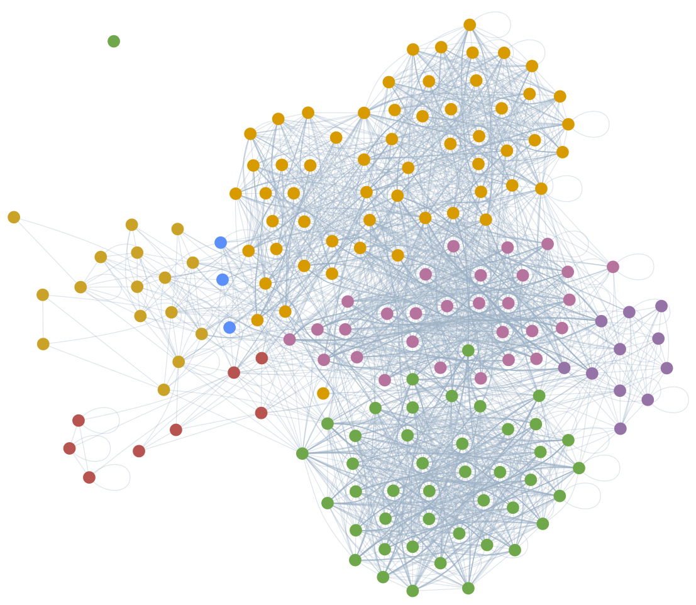
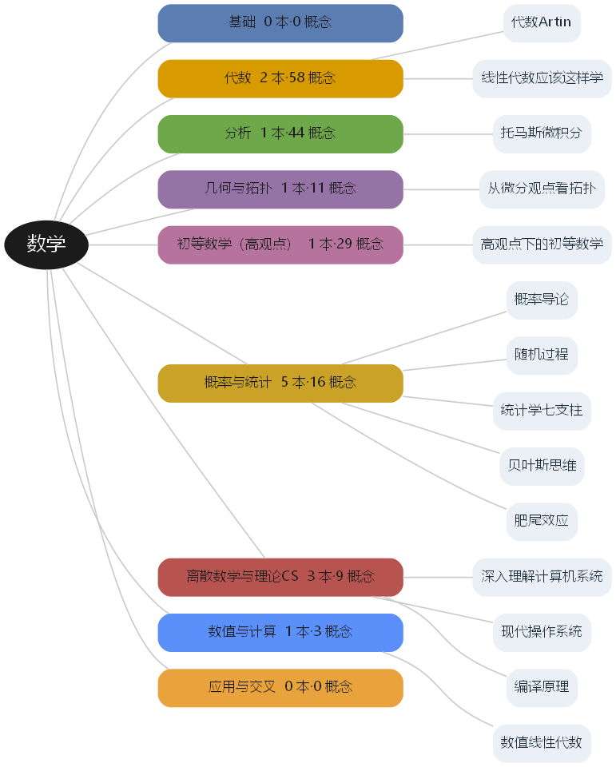
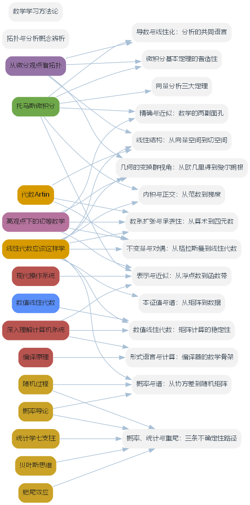
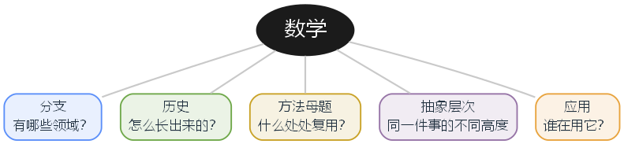

> 一本会随读书笔记库一起生长的数学导览：不是按分支罗列知识，而是按「联系」组织——同一母题在代数、分析、几何、概率、数值中反复出现。

## 本版信息

本 PDF 由 `build-book.mjs` 自动生成，构建日期 **2026-10-03**。

当前收录 **14** 本书、**169** 个概念节点：

- 《代数Artin》（代数）
- 《线性代数应该这样学》（代数）
- 《托马斯微积分》（分析）
- 《从微分观点看拓扑》（几何与拓扑）
- 《高观点下的初等数学》（初等数学（高观点））
- 《概率导论》（概率与统计）
- 《随机过程》（概率与统计）
- 《统计学七支柱》（概率与统计）
- 《贝叶斯思维》（概率与统计）
- 《肥尾效应》（概率与统计）
- 《深入理解计算机系统》（离散数学与理论CS）
- 《现代操作系统》（离散数学与理论CS）
- 《编译原理》（离散数学与理论CS）
- 《数值线性代数》（数值与计算）

> 增删书籍后，更新 `map.config.json` 与 `wiki/知识索引.md`，重新运行脚本即可刷新本 PDF。

\newpage

## 前言

这是一本**会长大的数学书**。

它不是一个完成态的教材，而是一个读书笔记库的实时投影：每多读一本书、每多写一个概念页，重新生成一次，这本书就会多出新的分支、新的概念、新的导读。所以它读起来会像一张被不断修订的地图，而不是一座一次性封顶的建筑。

### 为什么是「联系」，而不是「分支」

传统的数学书按学科切块：先算术、再代数、再几何、再分析。这样清楚，但也掩盖了一件事——**同一个想法会换上不同的外衣反复出现**。

- 「线性化」在代数里是矩阵，在分析里是导数，在几何里是切空间；
- 「对偶」在代数里是对偶空间，在几何里是极线配极，在分析里是傅里叶变换；
- 「不变量」在群论里是共轭类，在几何里是交比与度数，在概率里是充分统计量；
- 「逼近」在数值里是插值，在分析里是泰勒级数，在克莱因的笔下是函数带。

这些横跨分支的「母题」（leitmotif），才是把数学连成一个整体的东西。本书把**地图与主线放在前面**，把**单书导读与概念清单放在后面**：先给你一张网，再往网里挂具体的书。这样，即使某本书你还没读，也能从别的书里认出同一个想法。

### 这本书里有什么

| 部分 | 内容 | 作用 |
| --- | --- | --- |
| 一 · 五视角看数学 | 分支 / 历史 / 方法母题 / 抽象层次 / 应用 | 全书的骨架与小地图 |
| 二 · 交叉主线 | 每一条把两三个分支缝起来的主题页 | 全书的核心，最值得先读 |
| 三 · 各书导读 | 已收录教材的成书主线与章节地图 | 把网落到具体的书 |
| 四 · 分支与概念清单 | 分支 × 书 × 概念节点 | 自动生成，随书生长 |
| 五 · 学习方法论 | 史学→对抗→对话、线代基底、贝叶斯更新 | 读书方法本身 |

### 怎么读

1. **先读第二部分**的交叉主线，建立「联系感」；
2. 再用**第一部分**的五视角把联系归类；
3. 挑一本你正在读的书，看**第三部分**的导读，回到笔记库里的概念页深入；
4. 读不动时翻**第五部分**的方法论。

### 它是怎么生成的

本 PDF 由 `build-book.mjs` 从笔记库自动编译：读取 `数学大地图.md`、`map.config.json` 里登记的交叉主线与书目、以及 `wiki/知识索引.md` 的概念清单，合并为书稿后交给 Pandoc + XeLaTeX + 思源/宋体排版。

> 增删书籍后，更新 `map.config.json` 与 `wiki/知识索引.md`，重新运行脚本即可刷新本书。版本信息见下一页「本版信息」。

### 关于来源与限度

- 本书是**个人读书笔记的提炼**，概念页是索引与综述，不替代原教材的完整证明；
- 所引教材版权归原作者与出版社，本书仅供个人学习与分享，请勿用于商业分发；
- 数学在生长，本书也在生长：**它永远是一个版本，而不是终点**。

\newpage

```{=latex}
\clearpage
\thispagestyle{empty}
\addcontentsline{toc}{part}{图版 · 全书导览}
\pagecolor{natblue}
\vspace*{\fill}
{\centering\sffamily\bfseries\color{white}\fontsize{34}{40}\selectfont 图版 · 全书导览\par}
\vspace*{\fill}
\clearpage
\pagecolor{white}
```

## 全书图版

本页四幅图不是手绘，而是由 `build-figures.mjs` 从 `map.config.json` 与主题页**自动生成**——书目一变，图就跟着变。

{width=85%}

{width=85%}

{width=55%}

{width=100%}

\newpage

```{=latex}
\clearpage
\thispagestyle{empty}
\addcontentsline{toc}{part}{第一部分 · 五视角看数学}
\pagecolor{natblue}
\vspace*{\fill}
{\centering\sffamily\bfseries\color{white}\fontsize{34}{40}\selectfont 第一部分 · 五视角看数学\par}
\vspace*{\fill}
\clearpage
\pagecolor{white}
```

## 数学大地图

> 本库的**顶层入口**。分支只是看数学的**一个**视角；真正的价值在**联系**——同一母题反复出现在代数、分析、几何、概率、数值里。
> 可视版：数学大地图（Canvas）。

### 0. 五种视角（怎么读这张图）

| 视角 | 回答的问题 | 在哪一节 |
| --- | --- | --- |
| 一、分支 | 有哪些领域？ | §1 |
| 二、历史 | 它是怎么长出来的？ | §2 |
| 三、方法母题 | 什么东西**处处复用**？ | §3 |
| 四、抽象层次 | 同一件事在不同高度长什么样？ | §4 |
| 五、应用 | 谁在用它、用来做什么？ | §5 |

读法建议：**先用分支定位，再用母题跨域**；看到两条不同分支里出现同一个词（对偶、谱、不变量、极限），就顺着 §3 的链接追过去。

### 1. 视角一 · 分支（经典分类）

#### 基础 - 集合论 · 数理逻辑
- 公理化 · 范畴论
- 证明 / 类型论

#### 代数
- **代数Artin ** — 代数Artin（导读）
  群 · 群同态与同构 · 陪集与拉格朗日定理 · 正规子群与商群 · 置换群 · 凯莱定理 · 群作用 · 类方程与共轭类 · 西罗定理 · 自由群与生成元关系 · 环与理想 · 商环与环同态 · 多项式环 · 欧几里得整环与主理想整环 · 唯一分解整环 · 域与域扩张 · 伽罗瓦理论 · 对称函数 · 双线性型 · 线性群 · 李代数 · 群表示与特征标 · 正交群与旋转 · 平面等距与晶体群 · 模 · 代数整数与理想类群 · 有限域 · 佐恩引理
- **线性代数应该这样学 ** — 线性代数应该这样学（导读）
  复数 · 域 · 向量空间 · 组与Fⁿ · 子空间与直和 · 张成与线性无关 · 基与维数 · 线性映射 · 零空间与值域 · 线性映射基本定理 · 矩阵 · 可逆性与同构 · 积与商空间 · 对偶空间 · 多项式 · 本征值与本征向量 · 不变子空间 · 上三角化与对角化 · 内积与范数 · 规范正交基与格拉姆-施密特 · 正交补与极小化问题 · 伴随与自伴算子 · 谱定理 · 正算子、等距同构与极分解 · 奇异值分解 · 广义本征向量与幂零算子 · 特征多项式与极小多项式 · 若尔当形 · 复化 · 迹与行列式
- 抽象代数 · 表示论
- 交换代数 · 同调代数
- 数论

#### 分析
- **托马斯微积分 ** — 托马斯微积分（导读）
  函数 · 极限 · 连续性 · 导数 · 求导法则 · 隐式微分与相关变化率 · 线性化与微分 · 中值定理 · 洛必达法则 · 牛顿法 · 极值与最优化 · 双曲函数 · 反导数与不定积分 · 定积分 · 微积分基本定理 · 代换法则 · 分部积分与三角代换 · 部分分式与积分表 · 数值积分 · 反常积分 · 定积分的应用 · 旋转体体积 · 弧长与旋转曲面面积 · 功与流体压力 · 矩与质心 · 指数变化与可分离方程 · 数列与无穷级数 · 级数审敛法 · 幂级数与泰勒级数 · 幂级数 · 泰勒级数与麦克劳林级数 · 极坐标与圆锥曲线 · 向量与空间几何 · 向量值函数与曲率 · 偏导数 · 方向导数与梯度 · 多元极值与拉格朗日乘数 · 二重积分 · 三重积分 · 线积分 · 路径独立与势函数 · 格林定理 · 曲面积分与通量 · 斯托克斯定理与散度定理
- 实分析 · 复分析 · 泛函
- 微分方程 · 调和分析

#### 几何与拓扑
- **从微分观点看拓扑 ** — 从微分观点看拓扑（导读）
  光滑流形与光滑映射 · 切空间与导射 · 正则值与正则点 · Sard定理 · 模2度 · 定向流形与度 · 向量场与欧拉数 · 标架式协边 · Pontryagin构造 · 一维流形分类 · 代数基本定理-拓扑证明
- 点集拓扑 · 代数拓扑
- 微分几何 · 黎曼几何

#### 初等数学（高观点）
- **高观点下的初等数学 ** — 高观点下的初等数学（导读）
  承袭性原则 · 数系扩张 · 实数完备性 · 超越数 · 四元数与超复数 · 对数函数与指数函数 · 角函数 · 带符号的几何量 · 格拉斯曼行列式原理 · 滑动矢量与自由矢量 · 不变量与相对不变量 · 导出的流形 · 仿射变换 · 投影变换与齐次坐标 · 反演变换 · 对偶变换与对偶原理 · 变换群与爱尔朗根纲领 · 几何学基础与非欧几何 · 精确数学与近似数学 · 函数带 · 一致连续性与可积性 · 魏尔斯特拉斯函数 · 合理函数 · 拉格朗日插值与切比雪夫逼近 · 傅里叶级数与三角展开 · 球函数 · 康托集与完备集 · 皮亚诺曲线与若当曲线 · 正则曲线与解析曲线
- 初等算术 · 数论
- 经典几何 · 尺规作图

#### 概率与统计
- **概率导论 ** — 概率导论（导读）
  概率空间 · 条件概率与贝叶斯公式 · 大数定律与中心极限定理
- **随机过程 ** — 随机过程（导读）
  马尔可夫链 · 泊松过程 · 鞅 · 布朗运动
- **统计学七支柱 ** — 统计学七支柱（导读）
  描述统计与统计推断 · 似然 · 回归与回归均值
- **贝叶斯思维 ** — 贝叶斯思维（导读）
  贝叶斯推断 · 先验与后验 · 蒙特卡洛方法
- **肥尾效应 ** — 肥尾效应（导读）
  重尾分布 · 幂律分布 · 遍历性
- 信息论
- 因果推断

#### 离散数学与理论CS
- **深入理解计算机系统 ** — 深入理解计算机系统（导读）
  浮点数与IEEE 754 · 存储层次与局部性 · 虚拟内存
- **现代操作系统 ** — 现代操作系统（导读）
  进程与线程 · 死锁与同步 · 虚拟内存
- **编译原理 ** — 编译原理（导读）
  形式语言与自动机 · 词法与语法分析 · 编译流程与中间表示
- 组合 · 图论
- 算法 · 可计算性

#### 数值与计算
- **数值线性代数 ** — 数值线性代数（导读）
  矩阵范数与条件数 · QR分解与豪斯霍尔德变换 · 数值稳定性的后向误差
- 最优化 · 科学计算
- 数值微分方程

#### 应用与交叉 - 数学物理 · 数据科学
- 金融数学 · 运筹学

### 2. 视角二 · 历史脉络

数学不是按分支长出来的，而是按**问题**长出来的。抓几个「衔接处」，那里正是反例密集区（呼应 §7 的对抗式学习）：

| 阶段 | 旧范式的失效 | 催生的新语言 |
| --- | --- | --- |
| 算术 → 代数 | “数”不够用、方程解不出 | 符号、未知量、域与复数 |
| 初等几何 → 解析几何 | 纯综合几何难以计算 | 坐标、向量与空间几何 |
| 微积分初创 → 严格化 | 无穷小“说不清” | 极限、$\varepsilon$-$\delta$、实分析 |
| 具体 → 结构 | 各领域“各行其是” | 公理化：向量空间、群、拓扑空间 |
| 初等 → 高观点 | 初等对象孤立、缺动机 | 变换群、子行列式、函数带（Klein） |
| 结构 → 同调/范畴 | 结构之间关系难统一 | 函子、同调、层 |

### 3. 视角三 · 方法母题（数学处处是联系）

**这是全图的核心。** 同一母题横跨几乎所有分支——顺着行读，就能从一门课跳到另一门课。

| 母题 | 代数 | 分析 | 几何 / 拓扑 | 概率 / 统计 | 数值 / 离散 / 数据 |
| --- | --- | --- | --- | --- | --- |
| **线性化 / 逼近** | 线性映射 · 矩阵 | 导数 · 泰勒级数与麦克劳林级数 | 切空间与导射 · 局部坐标 | 线性回归 · CLT 近似 | 牛顿法 · 迭代法 · 拉格朗日插值与切比雪夫逼近 · 浮点 |
| **对偶** | 对偶空间 · 转置 | Fourier · 分布 · $L^p$–$L^q$ | Poincaré 对偶 · 对偶变换与对偶原理 | 特征函数 · 对偶问题 | 拉格朗日对偶 · 伴随 |
| **不变量 / 分类** | 秩 · 迹与行列式 · Galois | 守恒量 · 指标 | 模2度 · 向量场与欧拉数 · 同调 · 格拉斯曼行列式原理 · 变换群与爱尔朗根纲领 | 充分统计量 | 条件数 · 谱 |
| **对称 / 群作用** | 群 · 表示论 | 对称函数 | 对称空间 · Lie 群 | 可交换性 | 分块 · 置换群 |
| **极限 / 收敛** | 矩阵幂 · 谱半径 | 数列与无穷级数 · 一致收敛 · 实数完备性 · 一致连续性与可积性 | 紧性 · 同伦极限 | 大数律 · CLT | 迭代收敛 · 误差分析 |
| **分解 / 谱** | 谱定理 · 奇异值分解 · 若尔当形 | 特征函数 · Fourier · 球函数 | Laplace 特征值 | 马尔可夫链谱 · PCA | QR / SVD · 特征值算法 |
| **计数 / 测度** | 组合恒等式 | 定积分 · 测度 | 体积 · 度数 | 概率 · 期望 | 求和 · 复杂度 |
| **优化 / 变分** | 二次型 · 正定 | Euler–Lagrange · 最速下降 | 测地线 · 极小曲面 | MLE · EM | 凸优化 · 梯度下降 |

> 用法：遇到不熟的概念，先看它落在哪一行母题，再横向对照其他分支——「联系」本身就是学习杠杆。

### 4. 视角四 · 抽象层次

同一件事，在不同高度长得很不一样：

| 层次 | 关注 | 例子 |
| --- | --- | --- |
| L0 计算 | 怎么算 | 定积分、若尔当形、SVD 算法 |
| L1 结构 | 对象是什么 | 向量空间、群、拓扑空间 |
| L2 映射 | 对象之间怎么连 | 线性映射、连续映射、切空间与导射 |
| L3 联系本身 | 把“联系”当对象 | 函子、同调、层、范畴 |

> 你的「低维视角合成完整」（§7）对应这里：同一对象在 L0–L3 的投影各自片面，合起来才完整。

### 5. 视角五 · 应用与交叉

| 领域 | 用到的核心 | 本库相关 |
| --- | --- | --- |
| 物理 / 工程 | 微积分 · 微分方程 · 线性代数 | 向量场与欧拉数 · 线积分 · 斯托克斯定理与散度定理 |
| 数据 / ML | 线性代数 · 概率 · 最优化 | 奇异值分解 · 本征值与谱：从矩阵到数据 |
| 计算机图形 | 向量 · 线性变换 · 微积分 | 向量与空间几何 · 向量值函数与曲率 |
| 金融 / 运筹 | 概率 · 最优化 · 随机过程 | 概率论 · 最优化 |

### 6. 交叉主线（桥）

连接不同分支的同源思想，是本库区别于“孤立笔记堆”的关键。

- 导数与线性化：分析的共同语言 — 导数 / 线性映射 / 切空间是同一件事
- 线性结构：从向量空间到切空间 — 向量空间 / 基 / 线性映射的三书对照
- 内积与正交：从范数到梯度 — 内积、正交、最小二乘与梯度
- 本征值与谱：从矩阵到数据 — 本征值 / 谱定理 / Hessian / SVD
- 向量分析三大定理 — 格林 / 斯托克斯 / 散度（微积分内部的统一）
- 微积分基本定理的普适性 — 从 Newton–Leibniz 到 Stokes 到指标定理（各结构上的版本）
- 拓扑与分析概念辨析 — 紧致 / 正则 / 非退化等易混概念
- 微积分符号表 — 符号与中英术语对照
- 不变量与对偶：从格拉斯曼到线性代数 — 子式 / 对偶空间 / 不变量理论的几何原型
- 数系扩张与承袭性：从算术到四元数 — 数系 / 域 / 可除环的扩张阶梯
- 精确与近似：数学的两副面孔 — 函数带 / 合理函数 / 严格分析
- 几何的变换群视角：从欧几里得到爱尔朗根 — 变换群 / 不变量 / 流形
- 概率与谱：从协方差到随机矩阵 — 协方差 / 谱隙 / 随机矩阵
- 表示与近似：从浮点数到函数带 — 浮点数 / 函数带 / 数值分析
- 概率、统计与重尾：三条不确定性路径 — 概率 / 统计 / 重尾
- 形式语言与计算：编译器的数学骨架 — 正则 / CFG / 自动机 / 编译
- 数值线性代数：矩阵计算的稳定性 — 正交 / 条件数 / 后向误差

### 7. 学习方法论（元层）

本库不只是知识，也固化了一套学习方法，详见 数学学习方法论（原始对话：学习方法论-对话）：

1. **史学 → 对抗 → 对话**：在**新旧阶段的衔接处**收集反例（§2 的表就是这种衔接处）。
2. **理论以线性代数为基底**：它是分析/几何/数值/数据的共同底座。
3. **因地制宜的对抗式训练**：同题两种方法对刀，主动制造可控失败，要“决策报告”而非“结果”。
4. **贝叶斯更新**：分不清时先读书、放下、沉淀；不固化认知，永远保留被新视角改写的空间。
5. **合发生在联系里**：理解在联系中加深，没有终态——所以这张图永远会有下一条连线。

### 8. 如何扩展这张图

- 新书 → 在 §1 对应分支加一行，用双链指向该书实体页与「书名-导读」，并列出概念。
- 新联系 → 在 §3 母题表补一格，或（跨书更系统性时）在 §6 新增一条主题页，并登记 主题索引。
- 新视角 → 若发现现有五个视角不够，可在 §0 增加第六个（本图欢迎被改写）。
- 可视版 `数学大地图.canvas` 同步加减节点（id 唯一、边不悬空）。
- 维护规范见 AGENTS 与 `.pi/skills/build-wiki/`。

### 相关

- 总索引 · 知识索引 · 素材索引 · 产出索引 · 主题索引

\newpage

```{=latex}
\clearpage
\thispagestyle{empty}
\addcontentsline{toc}{part}{第二部分 · 交叉主线}
\pagecolor{natblue}
\vspace*{\fill}
{\centering\sffamily\bfseries\color{white}\fontsize{34}{40}\selectfont 第二部分 · 交叉主线\par}
\vspace*{\fill}
\clearpage
\pagecolor{white}
```

## 导数与线性化：分析的共同语言

### 概述

「求导」在三本书里是同一个动作：**用线性对象在局部逼近非线性对象**。一元微积分叫导数，多元微积分叫梯度和全微分，线性代数叫线性映射（及其矩阵），微分拓扑叫导射。理解这层统一，比记住三套记号更有用。

### 跨书对照

| 视角 | 局部线性对象 | 相关概念 |
| --- | --- | --- |
| 一元微积分 | 数 $f'(a)$、线性化 $L(x)$ | 导数 · 线性化与微分 |
| 多元微积分 | 梯度 $\nabla f$、雅可比矩阵 | 偏导数 · 方向导数与梯度 |
| 线性代数 | 线性映射 $T$、矩阵 $A$ | 线性映射 · 矩阵 |
| 微分拓扑 | 切映射 $df_x:T_xM\to T_xN$ | 切空间与导射 · 正则值与正则点 |

### 三条贯穿的主线

1. **链式法则是同一个公式**：$(f\circ g)'=f'(g)g'$；高维是雅可比矩阵相乘 $D(f\circ g)=Df\cdot Dg$；流形上是 $d(g\circ f)_x=dg_{f(x)}\circ df_x$。
2. **可逆  $\Leftrightarrow$  不塌陷**：一元 $f'(a)\ne0$；多元雅可比可逆（可逆性与同构）；流形上导射可逆即局部微分同胚。
3. **线性化服务近似与方程**：线性化与微分、牛顿法（一维）与多元牛顿法、隐函数/原像定理（拓扑）都是同一思想的产物。

### 与其他概念的关系

- 导数 · 线性映射 · 切空间与导射 · 偏导数 · 可逆性与同构

### 深入问题

- 为什么「导数」在一维是一个数，而在高维必须是线性映射而非一组数（梯度只是它的对偶表示）？
- 隐函数定理与商空间/第一同构定理在结构上如何对应？

### 参考源

- 托马斯微积分-第03章-微分法 · 托马斯微积分-第12章-偏导数
- 线性代数应该这样学-第03章-线性映射
- 从微分观点看拓扑-第01章-光滑流形和光滑映射

## 线性结构：从向量空间到切空间

### 概述

向量空间用八条公理抽掉「箭头」里与坐标无关的部分，于是函数、多项式、切空间都成了向量。这条抽象主线贯穿三本书：线性代数研究**结构本身**，微积分把它用在**几何与运动**上，微分拓扑把它用在**流形的局部**。

### 跨书对照

| 层次 | 对象 | 相关概念 |
| --- | --- | --- |
| 线性代数（抽象） | 向量空间、基、维数、线性映射 | 向量空间 · 基与维数 · 线性映射 |
| 微积分（坐标/几何） | 三维向量、点积叉积、直线平面 | 向量与空间几何 · 组与Fⁿ |
| 微分拓扑（局部） | 切空间、切映射 | 切空间与导射 · 光滑流形与光滑映射 |

### 三条贯穿的主线

1. **「基」给出坐标**：抽象的基在 $\mathbf{R}^n$ 里就是坐标轴，在流形上就是局部坐标图。
2. **保结构 = 线性**：线性映射在各处保持线性组合；在拓扑里它的推广（导射）保持切空间结构。
3. **维数与不变量**：$\dim$、秩、行列式 是跨领域的不变量；流形上对应维数与定向。

### 与其他概念的关系

- 向量空间 · 基与维数 · 线性映射 · 向量与空间几何 · 切空间与导射

### 深入问题

- 为什么「公理化」让线性代数能同时处理箭头、函数与切空间？
- 从 $\mathbf{R}^n$ 到流形，哪些线性代数的结论可以原样搬运，哪些必须加拓扑条件？

### 参考源

- 线性代数应该这样学-第01章-向量空间 · 线性代数应该这样学-第02章-有限维向量空间
- 托马斯微积分-第10章-向量与空间几何学
- 从微分观点看拓扑-第01章-光滑流形和光滑映射

## 内积与正交：从范数到梯度

### 概述

内积是给向量空间装上「尺子和量角器」的工具。它在线性代数里定义正交与投影，在微积分里体现为梯度垂直于等值面、曲线积分中的功，在数据科学里化为SVD 与最小二乘。

### 跨书对照

| 视角 | 内积/正交的体现 | 相关概念 |
| --- | --- | --- |
| 线性代数 | 范数、Cauchy–Schwarz、正交补、规范正交基 | 内积与范数 · 正交补与极小化问题 |
| 微积分 | 点积、投影、梯度⊥等值线、曲线的功 | 向量与空间几何 · 方向导数与梯度 · 线积分 |
| 数值/数据 | 最小二乘、正交对角化、主成分 | 奇异值分解 · 谱定理 |

### 三条贯穿的主线

1. **正交 = 独立**：规范正交组必线性无关；正交基让坐标只需投影（规范正交基与格拉姆-施密特）。
2. **最短 = 投影**：正交补与极小化问题的最优逼近就是正交投影，这正是最小二乘的几何。
3. **度量服务几何**：梯度、法向量、曲面积分都靠内积定义方向与长度（曲面积分与通量）。

### 与其他概念的关系

- 内积与范数 · 正交补与极小化问题 · 方向导数与梯度 · 奇异值分解 · 向量与空间几何

### 深入问题

- 为什么「正交」比「线性无关」更强，却能换来如此简洁的坐标公式？
- 从有限维内积到函数空间内积（傅里叶展开），哪些直觉保持不变？

### 参考源

- 线性代数应该这样学-第06章-内积空间 · 线性代数应该这样学-第07章-内积空间上的算子
- 托马斯微积分-第10章-向量与空间几何学 · 托马斯微积分-第12章-偏导数

## 本征值与谱：从矩阵到数据

### 概述

本征值是「只被拉伸、不被转向」方向上的倍数。它把复杂算子拆成若干独立的伸缩：线性代数里是谱定理与若尔当形，微积分里是多元极值的二次型判别，数据里是SVD/PCA。

### 跨书对照

| 视角 | 本征值的体现 | 相关概念 |
| --- | --- | --- |
| 线性代数 | 谱定理、若尔当形、正算子 | 本征值与本征向量 · 谱定理 · 若尔当形 |
| 微积分 | Hessian 的特征值决定极值/鞍点 | 多元极值与拉格朗日乘数 · 偏导数 |
| 数值/数据 | 奇异值、正交对角化、主成分 | 奇异值分解 · 正算子、等距同构与极分解 |

### 三条贯穿的主线

1. **对角化 = 找本征方向**：能拆则算子变成独立伸缩；不能拆的缺口由广义本征空间与若尔当形补上。
2. **对称带来正交**：谱定理保证正规/自伴算子有正交本征基，因此数值稳定、可解释。
3. **正定性 = 极值**：多元极值用二次型的本征值符号判断（多元极值与拉格朗日乘数），与正算子同源。

### 与其他概念的关系

- 本征值与本征向量 · 谱定理 · 奇异值分解 · 多元极值与拉格朗日乘数 · 迹与行列式

### 深入问题

- 为什么「对称 ⇒ 可正交对角化」在理论与数值上都如此关键？
- 若尔当形（精确但脆弱）与 SVD（稳定但非谱不变）各适合什么场景？

### 参考源

- 线性代数应该这样学-第05章-本征值与本征向量 · 线性代数应该这样学-第07章-内积空间上的算子 · 线性代数应该这样学-第08章-复向量空间上的算子
- 托马斯微积分-第12章-偏导数

## 微积分基本定理的普适性

> 提炼自 微积分的结构推广与大一统-对话。它是 数学大地图 §3「方法母题 · 对偶」的样板。

### 概述

所有版本的**同一句话**：

$$\langle d\omega,\ c\rangle=\langle \omega,\ \partial c\rangle\qquad(\text{内部微分} = \text{边界取值})$$

连续形式是**广义 Stokes 定理** $\displaystyle\int_M d\omega=\int_{\partial M}\omega$；离散形式是「上链的余边界 $d$」与「链的边界 $\partial$」的对偶。核心恒等式：$\partial\partial=0 \iff dd=0$。

### 各版本一览

| 版本 | 公式 | 所在结构 |
| --- | --- | --- |
| 经典（一维） | $\int_a^b f'\,dx=f(b)-f(a)$ | 区间 $[a,b]$ |
| Green | $\oint_{\partial D}P\,dx+Q\,dy=\iint_D(Q_x-P_y)\,dA$ | 平面区域 |
| 散度（Gauss） | $\oiint_{\partial V}\mathbf F\cdot d\mathbf S=\iiint_V\nabla\cdot\mathbf F\,dV$ | 空间体 |
| 经典 Stokes | $\oint_{\partial\Sigma}\mathbf F\cdot d\mathbf r=\iint_\Sigma(\nabla\times\mathbf F)\cdot d\mathbf S$ | 曲面 |
| 微分形式 Stokes | $\int_M d\omega=\int_{\partial M}\omega$ | 带边定向流形 |
| 梯度定理 | $\int_\gamma\nabla f\cdot d\mathbf r=f(q)-f(p)$ | 黎曼流形（路径无关） |
| Hodge 分解 | $\omega=d\alpha+d^*\beta+\gamma_{\text{harm}}$ | 紧黎曼流形（调和代表元） |
| Cauchy / 留数 | $\oint_\gamma f\,dz=2\pi i\sum\operatorname{Res}$ | 复流形（$\bar\partial f=0$） |
| Radon–Nikodym | $\nu(E)=\int_E\frac{d\nu}{d\mu}\,d\mu$ | 测度空间 |
| de Rham | $H^k_{\mathrm{dR}}(M)\cong H^k_{\mathrm{sing}}(M;\mathbb R)$ | 拓扑（闭 vs 恰当） |
| Atiyah–Singer | $\operatorname{index}(D)=\int_M\hat A(M)\operatorname{ch}(E)$ | 椭圆算子（分析 = 拓扑） |
| 离散（求和/图） | $\sum_{k=a}^{b-1}\Delta f(k)=f(b)-f(a)$ | 图 / 单纯复形 |

### 不同结构上的微积分

- **拓扑结构**：度量空间上的 Lipschitz 微积分、Sobolev 空间 $W^{1,p}$；Banach 流形上的无穷维微积分。
- **几何结构**：光滑流形（$df$、微分形式、$\star$）→ 黎曼流形（Levi-Civita 联络、测地线、Laplace–Beltrami）→ 辛流形（Hamilton 力学、Liouville、Floer）→ 复/Kähler 流形（$\partial,\bar\partial$、Hodge 分解）→ 图上的离散微积分。
- **代数结构**：交换代数的 **Kähler 微分** $\Omega_{A/k}$、Connes 的**非交换几何**（谱三元组、循环上同调）、超流形（Berezin 积分）、形式幂级数 / $p$-进微积分、**$D$-模**、量子群上的 $q$-导数。

### 大一统的四条线

1. **代数 ↔ 几何镜像对偶**：Gelfand 对偶、Hilbert 零点定理、Grothendieck 概形。
2. **分析 ↔ 拓扑**：de Rham 定理、Hodge 定理、谱几何（Weyl 定律）。
3. **数论 ↔ 几何**：Weil 猜想 × Lefschetz 不动点、概形统一 $\mathbb Z$ 与曲线。
4. **表示论的中心地位**：抽象结构 → 线性算子 → 谱 → 对称性（Langlands、Wigner）。

### 与其他概念的关系

- 微积分基本定理 · 格林定理 · 斯托克斯定理与散度定理 · 向量分析三大定理
- 线积分 · 路径独立与势函数 · 切空间与导射 · 模2度 · 向量场与欧拉数

### 深入问题

- 为什么 $\partial\partial=0$（边界的边界为空）是一切的代数根源？
- 「内部微分 = 边界取值」的对偶形式如何在**任意**范畴/函子语言中表述？
- 指标定理之后，「推广」还剩下哪些前沿（导出代数几何、镜像对称、动机理论）？

### 参考源

- 微积分的结构推广与大一统-对话

## 向量分析三大定理

### 概述

格林定理、斯托克斯定理、散度定理不是三个孤立结论，而是微积分基本定理沿“维度阶梯”的推广。共同句式：

> **边界上的积分 = 区域内部（导数）的积分。**

### 统一的句式

| 定理 | 维度 | 边界积分 | 内部积分 | 导数算子 |
| --- | --- | --- | --- | --- |
| 微积分基本定理 | 1D | $f(b)-f(a)$ | $\int_a^b f'\,dx$ | $d/dx$ |
| 格林定理 | 2D | $\oint_C M\,dx+N\,dy$ | $\iint_R(N_x-M_y)\,dA$ | 旋度（z 分量） |
| 斯托克斯定理 | 2D 曲面 / 3D | $\oint_C\mathbf F\cdot d\mathbf r$ | $\iint_S(\nabla\times\mathbf F)\cdot\mathbf n\,dS$ | 旋度 $\nabla\times$ |
| 散度定理 | 3D | $\oiint_S\mathbf F\cdot\mathbf n\,dS$ | $\iiint_D\nabla\cdot\mathbf F\,dV$ | 散度 $\nabla\cdot$ |

### 直观

- **旋度—环流**：一个小水轮的转速，沿边界累积起来就是绕大圈的总环流（斯托克斯/格林）。
- **散度—通量**：每个小体积内“冒出”或“吸入”的量，加起来就是穿出整个闭曲面的净流量（散度定理）。
- 左右两边是同一个物理量的两种数法：**盯着边界数** vs **盯着内部数**。

### 现代统一：广义斯托克斯定理

用微分形式写成一个公式：

$$\int_{\partial M}\omega=\int_M d\omega,$$

其中 $\omega$ 是微分形式，$d$ 是外微分。格林、斯托克斯、散度都是它在不同维数与不同形式下的特例。这也解释了为什么三种“导数”（梯度、旋度、散度）其实都是同一个 $d$。

### 使用要点

- **定向永远要一致**：曲面正侧与边界正向满足右手法则；闭曲面取外侧。
- 定理要求场在区域内**处处可导**；遇奇点要挖洞或分段。
- 前提是区域**单连通**（对“无旋 ⇒ 保守”类结论尤其关键，见路径独立与势函数）。

### 与其他概念的关系

- 微积分基本定理 · 格林定理 · 线积分 · 曲面积分与通量 · 斯托克斯定理与散度定理

### 深入问题

- 为什么“旋度 = 最大环流密度”“散度 = 通量密度”？局部定义如何从积分形式反推？
- 没有统一定理的话，四个定理各自证明的难点在哪里？
- 微分形式与 de Rham 上同调如何解释“旋度为零却不保守”的拓扑障碍？

### 参考源

- 托马斯微积分-第14章-向量场中的积分
- 托马斯微积分-第14章-向量场中的积分

## 拓扑与分析概念辨析

> 提炼自 概念辨析集-对话。用于澄清地图上**几何与拓扑**分支里最容易混淆的一组概念。

### 逐条辨析

#### 非退化（non-degenerate）
「退化」= 丢掉了一个本该给出的方向/维度。各领域表现：矩阵可逆且行列式 $\ne0$；双线性型 $\det\ne0$；二次曲线非退化（圆锥 vs 直线/点）；临界点 Hessian 非奇异；概率分布有密度、$\sigma$-代数不塌缩。**大多数场合「非退化」=「可逆 / 满秩」**，个别场合更宽。

#### 无边流形
流形每点邻域同胚于 $\mathbb R^m$（**不含半空间**），因此没有「边缘」。$S^n$、环面 $T^n$ 无边；闭圆盘 $D^n$、$[0,1]$ 有边。**无边性是 Stokes/散度定理、模2度、Poincaré 对偶等能成立的前提**。

#### 高斯映射（Gauss map）
把超曲面上每点映到它的**单位法向量** $\gamma:M^{n}\to S^{n-1}$。它把曲面的弯曲转成一个球面映射——**曲率 = 高斯映射的导射（Weingarten 映射）**，其度给出 Gauss–Bonnet。

#### 调和函数与唯一延拓
Dirichlet 问题（给定边界值求调和函数）在实分析里解存在且唯一；复分析里更强（Poisson 积分给出显式解）。真正的「复刚性」是**解析延拓**：一个解析函数在任一开集上的值完全决定它在连通区域上的值。

#### 正则曲线 / 正则函数
- **正则曲线**：只要求 $\mathbf r'(t)\ne\mathbf 0$（即 $C^1$ 且切向量非零），**不需要 $C^\infty$**。它保证曲线「不折返、不静止」。
- 「正则函数」是 19 世纪通用术语，**不是 Klein 发明的**；Klein 的相关贡献是几何函数论 / 自守函数。

#### 紧致性（compactness）
核心直觉：**有限、不能逃逸、没有缺口**。欧氏空间中由 **Heine–Borel**：有界 + 闭 $\iff$ 紧。本质定义：任意开覆盖有有限子覆盖。典型非紧：$(0,1)$（缺口）、$\mathbb R$（逃逸）、无限离散集（不有限）。

#### 闭集 ≠ 紧致
**单向**：紧致 $\Rightarrow$ 闭（在 Hausdorff 空间），反之不成立（$\mathbb R$ 闭但不紧）。「闭包属于自身」只保证闭，不保证能用有限覆盖截住。

#### 绕数 / 留数 / 莫比乌斯
- **绕数**：曲线绕一点转的圈数（$S^1\to S^1$ 的度）；
- **留数**：奇点处的局部贡献，留数定理 $\oint f\,dz=2\pi i\sum\operatorname{Res}$ 是 Stokes 定理在奇点处的版本；
- **莫比乌斯变换**：负责把「洞 / 奇点」在复平面上「搬家」，使绕数与留数计算统一。

### 与其他概念的关系

- 光滑流形与光滑映射 · 切空间与导射 · 正则值与正则点 · 模2度 · 向量场与欧拉数 · 微积分基本定理的普适性

### 深入问题

- 「非退化」在各领域的统一含义是什么？为什么它是「可解/可逆」的同义词？
- 为什么复分析的「唯一延拓」比实分析强这么多？
- 紧致性在证明「存在性定理」（EVT、极值、不动点）里扮演什么角色？

### 参考源

- 概念辨析集-对话

## 不变量与对偶：从格拉斯曼到线性代数

### 一句话

克莱因第二卷的格拉斯曼行列式原理与对偶变换与对偶原理，是线性代数中**子式、外代数、对偶空间** 的几何原型；「几何 = 变换群下的不变量」正是双线性型与迹与行列式的几何化身。

### 三条对应

| 克莱因（几何） | 线性代数（Axler / Artin） | 现代语言 |
| --- | --- | --- |
| 点坐标矩阵的子行列式 | 行列式与子式 | 外代数 $\bigwedge^k V$ 的分量 |
| 带符号的几何量（面积、体积） | 行列式的多重线性与反对称 | 微分形式、体积元 |
| 对偶变换与对偶原理（点↔线） | 对偶空间 $V^*$、转置 | 配极、线性系统 |
| 不变量与相对不变量 | 群作用下的不变量、二次型 | Hilbert 不变量理论 |
| 变换群与爱尔朗根纲领 | 线性群、群作用 | 齐性空间、表示论 |
| 滑动矢量与自由矢量（力、力矩） | 向量 + 反对称张量 | 螺旋、Lie 代数 $\mathfrak{so}(3)$ |

### 核心母题

- **反对称 = 有向几何**：行列式的交换变号，就是面积的定向；这条线索从 $2\times2$ 行列式一路走到微分形式。
- **对偶 = 配对**：极线配极是二次型的极化配对 $v\mapsto q(v,\cdot)$；双线性型的非退化性保证它可逆。
- **不变量 = 群轨道上的函数**：等距群→距离；仿射群→平行比；射影群→交比；一般线性群→秩与行列式。

### 为什么值得连起来读

- 读 从微分观点看拓扑 时，切空间与导射、模2度、Stokes 定理的本质都是「反对称 + 对偶 + 不变量」。
- 读 线性代数应该这样学 时，对偶空间 是抽象概念；在克莱因这里它有**极线、力偶、力矩**等实物。
- 读 代数Artin 时，双线性型与线性群的几何来源就是这里的变换群与不变量。

### 相关

- 克莱因侧：格拉斯曼行列式原理 · 对偶变换与对偶原理 · 不变量与相对不变量 · 带符号的几何量 · 变换群与爱尔朗根纲领 · 滑动矢量与自由矢量 · 导出的流形
- 线性代数侧：对偶空间 · 双线性型 · 迹与行列式 · 本征值与本征向量 · 线性群 · 群作用
- 拓扑侧：切空间与导射 · 斯托克斯定理与散度定理

### 参考源

- 高观点下的初等数学-第11章-平面上的格拉斯曼行列式原理
- 高观点下的初等数学-第13章-直角坐标变换下空间基本图形的分类
- 高观点下的初等数学-第18章-空间元素改变而造成的变换

## 数系扩张与承袭性：从算术到四元数

### 一句话

每一次数系扩张，都是在**保住旧运算律**的前提下解决一个新方程；撑不住时，就牺牲一条最贵的定律——这就是承袭性原则，也是域扩张与群结构的代数原型。

### 扩张的阶梯

| 数系 | 解决的方程 | 保住的 | 牺牲的 | 代数结构 |
| --- | --- | --- | --- | --- |
| $\mathbf N$ | — | 加乘结合、交换、分配 | — | 半环 |
| $\mathbf Z$ | $x+a=b$ | 全部算术律 | 「减法受限」 | 整环 |
| $\mathbf Q$ | $bx=a$ | 全部算术律 | 「可数对象」直觉 | 域 |
| $\mathbf R$ | $x^2=2$ | 全部算术律 + 序 + 完备 | — | 完备有序域（实数完备性） |
| $\mathbf C$ | $x^2+1=0$ | 域公理 | **有序性** | 代数闭域（代数基本定理-拓扑证明） |
| $\mathbf H$ | 三维旋转的代数 | 除法（可除环） | **乘法交换律** | 可除环 |

### 三条线索

- **可数 vs 可量度**：整数来自计数、分数来自测量——数系扩张 的两套来源。
- **承袭性**：每步扩张都尽量保留旧定律；越往高维，能保的越少（Hurwitz 定理）。
- **抽象化**：把「数」换成「域元素」，扩张变成 域与域扩张；把「四元数」换成「非交换环」，得到 群、线性群 与 李代数。

### 为什么值得连起来读

- 线性代数应该这样学 从复数与域的公理出发；克莱因给出**这些公理为什么长这样**的历史与动机。
- 代数Artin 讲群、环与理想、域与域扩张；承袭性原则是「为什么要引入新结构」的答案。
- 超越数 与 实数完备性 说明「填满数轴」与「方程可解」是两件不同的事。
- 伽罗瓦理论 把「方程可解」翻译成群的可解性，是承袭性思想的代数终局。

### 相关

- 克莱因侧：数系扩张 · 承袭性原则 · 实数完备性 · 四元数与超复数 · 超越数 · 复数
- 代数侧：域 · 群 · 线性群 · 域与域扩张 · 代数基本定理-拓扑证明 · 伽罗瓦理论
- 分析侧：极限 · 实数完备性 · 幂级数

### 参考源

- 高观点下的初等数学-第02章-数的概念的第一个扩张
- 高观点下的初等数学-第02章-数的概念的第一个扩张
- 高观点下的初等数学-第04章-复数

## 精确与近似：数学的两副面孔

### 一句话

精确数学与近似数学 提醒我们：数学既处理**理想对象之间的严格关系**，也处理**经验量之间「在幅度内成立」的精确关系**；后者不是「不严格」，而是严格地研究误差本身。

### 两副面孔的对照

| 精确面孔 | 近似面孔 | 本库对应 |
| --- | --- | --- |
| 点、实数、函数 | 函数带（宽度 $\delta$） | 实数完备性 · 极限 |
| 柯西连续、一致连续 | 「经验曲线的连续程度」 | 一致连续性与可积性 |
| 可微、解析函数 | 合理函数（导数受控） | 泰勒级数与麦克劳林级数 |
| 处处连续处处不可微 | 直观无法实现精确断言 | 魏尔斯特拉斯函数 |
| 定积分（黎曼） | 数值积分与误差估计 | 数值积分 · 定积分 |
| 傅里叶级数（精确展开） | 有尽三角插值、最小二乘 | 傅里叶级数与三角展开 · 拉格朗日插值与切比雪夫逼近 |
| 曲线（正则、解析） | 逼近理想曲线、样条 | 正则曲线与解析曲线 · 皮亚诺曲线与若当曲线 |

### 核心洞见

1. **经验领域只有函数带**：测量精度给出 $\delta$，理想函数是 $\delta\to0$ 的极限。
2. **误差必须被精确处理**：忽略傅里叶余项会得出完全错误的结论（气象学例子）。
3. **直观是发现之源，不是证明之据**：魏尔斯特拉斯函数、皮亚诺曲线都击穿直观。
4. **近似本身值得成为严格课题**：区间分析、数值分析、样条、机器学习的不确定性，都是它的后代。

### 为什么值得连起来读

- 托马斯微积分 讲极限、连续性、泰勒级数；克莱因补充「**为什么**经验世界逼出这些概念」。
- 拓扑与分析概念辨析 辨析连续、紧致、正则等；这里给出它们的「经验对应物」。
- 数学学习方法论 的「史学→对抗→对话」「贝叶斯更新」与克莱因「在经验与理想之间往返」的方法一致。

### 相关

- 克莱因侧：精确数学与近似数学 · 函数带 · 合理函数 · 魏尔斯特拉斯函数 · 一致连续性与可积性 · 拉格朗日插值与切比雪夫逼近 · 傅里叶级数与三角展开
- 分析侧：极限 · 连续性 · 定积分 · 数值积分 · 泰勒级数与麦克劳林级数 · 实数完备性
- 元层：拓扑与分析概念辨析 · 数学学习方法论

### 参考源

- 高观点下的初等数学-第22章-关于单个自变数x的阐释
- 高观点下的初等数学-第23章-单变数x的函数 y=f(x)
- 高观点下的初等数学-第25章-进一步阐述函数的三角函数表示

## 几何的变换群视角：从欧几里得到爱尔朗根

### 一句话

变换群与爱尔朗根纲领：几何学 = 给定变换群下**不变量的理论**。这条思想从欧氏几何一路贯通到线性群、李代数 与微分流形。

### 群的层级与几何

$$\underbrace{\text{等距}}_{\text{度量几何}}\subset\underbrace{\text{仿射}}_{\text{仿射几何}}\subset\underbrace{\text{射影}}_{\text{射影几何}}$$

再加 Möbius 群（共形几何）、同胚群（拓扑）、微分同胚群（微分几何）。群越大，不变量越少：

| 几何 | 变换群 | 基本不变量 | 本库概念 |
| --- | --- | --- | --- |
| 度量 | 等距群 | 距离、角度 | 正交群与旋转 |
| 仿射 | 仿射群 | 平行、线段比、面积比 | 仿射变换 |
| 射影 | 射影群 | 交比、共线 | 投影变换与齐次坐标 |
| 反演/共形 | Möbius 群 | 角度、圆族 | 反演变换 |
| 拓扑 | 同胚群 | 连通、紧致 | 拓扑与分析概念辨析 |
| 微分 | 微分同胚群 | 光滑结构 | 光滑流形与光滑映射 · 切空间与导射 |

### 核心母题

- **不变量取代图形**：几何对象 = 群轨道；几何命题 = 不变量的关系（不变量与相对不变量）。
- **绝对形**：射影几何是「全部几何」，其余几何由无穷远处的绝对形（圆锥曲线）界定——凯莱原理。
- **从群到 Lie**：连续变换群 → 李代数；几何的无穷小版本即切空间与导射。
- **平行公理与群**：非欧几何可用不同的运动群刻画（几何学基础与非欧几何）。

### 为什么值得连起来读

- 从微分观点看拓扑 的流形、切空间、度数都是「微分同胚群下的不变量」。
- 代数Artin 的线性群、正交群与旋转、李代数 是变换群的代数骨架。
- 线性代数应该这样学 的群作用与对偶空间给出变换群和不变量的抽象语言。

### 相关

- 克莱因侧：变换群与爱尔朗根纲领 · 仿射变换 · 投影变换与齐次坐标 · 反演变换 · 几何学基础与非欧几何 · 不变量与相对不变量 · 导出的流形
- 代数侧：群 · 群作用 · 线性群 · 正交群与旋转 · 李代数 · 双线性型
- 几何/拓扑侧：光滑流形与光滑映射 · 切空间与导射 · 正交补与极小化问题 · 拓扑与分析概念辨析

### 参考源

- 高观点下的初等数学-第20章-系统的讨论
- 高观点下的初等数学-第21章-几何学基础
- 高观点下的初等数学-总结-几何全卷总结

## 概率与谱：从协方差到随机矩阵

### 一句话

概率论里最有力的工具往往是**线性的**：把随机变量看成向量、把协方差看成内积、把马尔可夫链的收敛看成谱问题。

### 三条对应

| 概率对象 | 线性代数对象 | 本库概念 |
| --- | --- | --- |
| 随机变量 $X,Y$ | 向量 | 向量空间 · 概率空间 |
| 协方差 $\mathrm{Cov}(X,Y)$ | 内积 | 内积与范数 |
| 协方差矩阵 $\Sigma$ | 半正定矩阵 | 正算子 · 谱定理 |
| 马尔可夫转移矩阵 $P$ | 随机矩阵（行和 1） | 马尔可夫链 |
| 收敛速度 / 混合时间 | 谱隙 $\lambda_2$ | 谱定理 |
| PCA / 降维 | 特征分解 / SVD | 奇异值分解 · 本征值与谱：从矩阵到数据 |

### 核心母题

- **内积 = 相关**：协方差是「去均值后的内积」；相关系数是单位化后的夹角余弦。
- **谱 = 收敛**：马尔可夫链收敛由 $P$ 的第二大特征值决定，谱隙越大越快。
- **谱 = 结构**：随机矩阵理论描述「大量随机」的普适谱形（Wigner 半圆律），是重尾与 CLT 之外的另一类极限。

### 为什么值得连起来读

- 概率导论 的协方差与 线性代数应该这样学 的内积与范数 是同一件事的两种语言。
- 随机过程 的平稳分布就是转移矩阵的特征向量；遍历定理是谱分解的概率版本。
- 本征值与谱：从矩阵到数据 讲 PCA/SVD；这里补充它背后的概率模型。

### 相关

- 概率侧：概率空间 · 大数定律与中心极限定理 · 马尔可夫链 · 布朗运动
- 代数侧：向量空间 · 内积与范数 · 谱定理 · 奇异值分解 · 本征值与谱：从矩阵到数据

### 参考源

- 概率导论-伴读
- 随机过程-伴读

## 表示与近似：从浮点数到函数带

### 一句话

IEEE 754 浮点数 是「用有限位表示实数」，函数带 是「用有限精度表示经验函数」——两者都是**有限逼近无限**，也都必须面对舍入、误差与稳定性。

### 三条对应

| 计算机系统 | 精确 / 近似数学 | 本库概念 |
| --- | --- | --- |
| 浮点数舍入（就近偶数） | 实数的有限表示 | 精确数学与近似数学 · 实数完备性 |
| $0.1+0.2\neq0.3$ | 0.1 的二进制不可终止 | 数系扩张 |
| 浮点非结合 / 误差累积 | 函数带宽度 $\delta$ 与误差传播 | 函数带 |
| 数值稳定性 | 逼近的余项控制 | 合理函数 · 拉格朗日插值与切比雪夫逼近 |
| 缓存分块 / 局部性 | 分块算法与数值线性代数 | 存储层次与局部性 |
| 数值积分实现 | Riemann 和的近似 | 数值积分 · 定积分 |

### 核心母题

- **有限表示必然有误差**：实数不可数、机器可数，误差不是 bug 而是结构。
- **误差必须被精确处理**：克莱因的「近似数学是关于近似关系的精确数学」，正是浮点误差分析的哲学。
- **稳定性 = 良态**：条件数刻画「输入扰动放大到输出」的程度，与数值分析的余项估计同源。

### 为什么值得连起来读

- 深入理解计算机系统 第 2 章的浮点数，为 托马斯微积分 的泰勒展开 提供一个「落地场景」。
- 高观点下的初等数学 第三卷的「精确 vs 近似」在这里获得工程化身。
- 数值积分、拉格朗日插值与切比雪夫逼近 是二者交汇处的方法。

### 相关

- 计算机侧：浮点数与IEEE 754 · 存储层次与局部性 · 虚拟内存
- 数学侧：精确数学与近似数学 · 函数带 · 合理函数 · 数值积分 · 拉格朗日插值与切比雪夫逼近 · 泰勒级数与麦克劳林级数

### 参考源

- 深入理解计算机系统-伴读
- 高观点下的初等数学-第22章-关于单个自变数x的阐释

## 概率、统计与重尾：三条不确定性路径

### 一句话

面对同一个未知，概率 问「模型给出什么分布」，统计 问「数据反推什么结论」，重尾 问「当经典定理失效时还剩什么」。三者层层递进，缺一不可。

### 三条路径

| 路径 | 核心问题 | 关键工具 | 本库概念 |
| --- | --- | --- | --- |
| **概率（演绎）** | 已知分布，事件的概率是多少？ | 公理、条件期望、极限定理 | 概率空间 · 大数定律与中心极限定理 |
| **统计（归纳）** | 已知数据，参数/模型是什么？ | 似然、贝叶斯、设计 | 似然 · 贝叶斯推断 · 回归与回归均值 |
| **重尾（边界）** | 当方差/均值不存在会怎样？ | 极值理论、遍历性 | 重尾分布 · 幂律分布 · 遍历性 |

### 核心母题

- **从「已知正演」到「未知反演」**：概率正演，统计反演，贝叶斯把反演写成概率本身。
- **从「平均」到「尾部」**：经典统计围绕均值与方差；重尾世界要求转向极值。
- **从「集合平均」到「时间平均」**：遍历性 提醒期望并不等于长期命运。

### 为什么值得连起来读

- 概率导论 与 随机过程 提供演算与模型；
- 统计学七支柱 与 贝叶斯思维 提供推断的两大范式（频率 / 贝叶斯）；
- 肥尾效应 提供「模型失效」的清醒剂；
- 与 概率与谱：从协方差到随机矩阵 一起，构成概率—线代—统计的三角。

### 相关

- 概率导论 · 随机过程 · 统计学七支柱 · 贝叶斯思维 · 肥尾效应
- 概率空间 · 似然 · 贝叶斯推断 · 重尾分布 · 遍历性 · 大数定律与中心极限定理

### 参考源

- 统计学七支柱-伴读
- 肥尾效应-伴读

## 形式语言与计算：编译器的数学骨架

### 一句话

编译器不是在「猜」程序的意思，而是在**用自动机识别语言**：正则语言搭配有限自动机、上下文无关语言搭配下推自动机、再到 SSA 与数据流分析。

### 三条对应

| 语言 / 计算 | 数学结构 | 编译中的角色 | 本库概念 |
| --- | --- | --- | --- |
| 正则语言 | 有限自动机 | 词法分析 | 形式语言与自动机 · 词法与语法分析 |
| 上下文无关语言 | 下推自动机 | 语法分析 | 词法与语法分析 |
| 数据流不动点 | 格与单调函数 | 优化 | 编译流程与中间表示 |
| 寄存器分配 | 图着色 | 后端 | 编译流程与中间表示 |
| 指令执行 | 有限状态 + 存储 | 运行 | 深入理解计算机系统 |

### 核心母题

- **识别能力 = 记忆能力**：有限状态 < 栈 < 带 < 无止境——计算能力层级。
- **分层解耦**：前端（语言）与后端（机器）通过 IR 分离。
- **自动化理论**：从正则到 DFA 的构造，是「把规格变成算法」的范例。

### 为什么值得连起来读

- 编译原理 把 形式语言与自动机 从定义带到工地；
- 深入理解计算机系统 展示编译产物如何在硬件上运行；
- 现代操作系统 提供运行时（栈、内存、系统调用）的另一半。

### 相关

- 形式语言与自动机 · 词法与语法分析 · 编译流程与中间表示 · 编译原理
- 深入理解计算机系统 · 现代操作系统 · 存储层次与局部性

### 参考源

- 编译原理-伴读
- 编译原理-伴读

## 数值线性代数：矩阵计算的稳定性

### 一句话

线性代数告诉你「解是什么」；数值线性代数 告诉你「在浮点机器上能不能算出来」——两者之间的桥，是 条件数 与 后向误差。

### 三条对应

| 精确线性代数 | 数值线性代数 | 本库概念 |
| --- | --- | --- |
| 正交矩阵 $Q^*Q=I$ | 正交变换不放大误差 | 正交群与旋转 · QR分解与豪斯霍尔德变换 |
| SVD $A=U\Sigma V^*$ | 条件数 $\sigma_1/\sigma_n$、低秩逼近 | 奇异值分解 · 矩阵范数与条件数 |
| 最小二乘投影 | 用 QR 而非正规方程 | 正交补与极小化问题 · 回归与回归均值 |
| 实数 / 精确算术 | 浮点数、$\varepsilon_{\text{mach}}$ | 浮点数与IEEE 754 · 精确数学与近似数学 |
| 特征值分解 | 迭代算法（幂法、QR 算法） | 本征值与本征向量 · 谱定理 |

### 核心母题

- **正交 = 稳定**：凡能用正交变换就不用一般变换。
- **问题 vs 算法**：条件数是问题属性，稳定性是算法属性；「病态≠不稳定」。
- **后向误差三段论**：前向误差 ≲ 条件数 × 后向误差。
- **有限精度是结构**：浮点误差不是 bug，而是数值数学的对象（呼应 精确数学与近似数学）。

### 为什么值得连起来读

- 线性代数应该这样学 / 代数Artin 给理论；数值线性代数 给算法。
- 表示与近似：从浮点数到函数带 讲「有限表示」的数学侧；这里讲矩阵计算的工程侧。
- 概率与谱：从协方差到随机矩阵 的 PCA/SVD 需要这里的条件数直觉。

### 相关

- 数值侧：矩阵范数与条件数 · QR分解与豪斯霍尔德变换 · 数值稳定性的后向误差 · 数值线性代数
- 理论侧：线性映射 · 奇异值分解 · 正交补与极小化问题 · 本征值与本征向量
- 系统侧：浮点数与IEEE 754 · 存储层次与局部性

### 参考源

- 数值线性代数-伴读
- 数值线性代数-伴读

\newpage

```{=latex}
\clearpage
\thispagestyle{empty}
\addcontentsline{toc}{part}{第三部分 · 各书导读}
\pagecolor{natblue}
\vspace*{\fill}
{\centering\sffamily\bfseries\color{white}\fontsize{34}{40}\selectfont 第三部分 · 各书导读\par}
\vspace*{\fill}
\clearpage
\pagecolor{white}
```

## 《代数》（Artin）导读

### 概述

整理自 代数Artin-伴读。主线：**具体（矩阵）→ 结构（群/环/域）→ 统一（同态、商、对应）**。Artin 的独特之处是**先讲矩阵与对称，再抽象**，并把几何（对称、旋转、晶体）与现代代数（表示、模、类群）都纳入。

### 章节地图

| 章 | 主题 | 关键概念 |
| --- | --- | --- |
| 1 | 矩阵 | 矩阵 · 迹与行列式 |
| 2 | 群论 | 群 · 群同态与同构 · 陪集与拉格朗日定理 · 正规子群与商群 |
| 3 | 向量空间 | 向量空间 · 基与维数 |
| 4 | 线性变换 | 线性映射 · 零空间与值域 |
| 5 | 正交性 | 正交群与旋转 |
| 6 | 对称 | 平面等距与晶体群 · 群作用 · 置换群 |
| 7 | 群论进阶 | 凯莱定理 · 类方程与共轭类 · 西罗定理 · 自由群与生成元关系 |
| 8 | 双线性型 | 双线性型 |
| 9 | 线性群 | 线性群 · 李代数 |
| 10 | 群表示 | 群表示与特征标 |
| 11 | 环 | 环与理想 · 商环与环同态 · 多项式环 |
| 12 | 因子分解 | 欧几里得整环与主理想整环 · 唯一分解整环 |
| 13 | 代数整数 | 代数整数与理想类群 |
| 14 | 模 | 模 |
| 15 | 域 | 域与域扩张 · 有限域 |
| 16 | 伽罗瓦理论 | 对称函数 · 伽罗瓦理论 · 佐恩引理 |

### 三个转折点

1. **第 2 章**：群——从“具体对称”跃到“抽象运算”。
2. **第 7 章**：西罗定理——用算术（$p$-幂、计数）分类有限群；$A_n$ 单伏笔五次方程。
3. **第 16 章**：伽罗瓦理论——群与域的完美对偶，解决“方程根式可解性”。

### 与线性代数的关系

Artin 与 线性代数应该这样学（Axler）同讲向量空间与算子，但：

- Axler：**结构优先**，从公理出发，行列式压轴；
- Artin：**具体优先**，从矩阵与群出发，几何与表示贯穿。

两者互补，见跨书主线 本征值与谱：从矩阵到数据、线性结构：从向量空间到切空间。

### 学习建议

- 先把 群、群同态与同构、陪集与拉格朗日定理 打通，后面处处复用。
- 环与理想 与 模 抓住“理想 = 群论的正规子群”这一类比。
- 伽罗瓦理论 建议配合 对称函数 与 置换群 一起读。
- 对抗式训练：用 西罗定理 证“某阶群必非单”，用 非 UFD 的 $\mathbb{Z}[\sqrt{-5}]$ 制造反例。

### 参考源

- 代数Artin-伴读

## 《线性代数应该这样学》导读

### 概述

整理自 线性代数应该这样学-伴读。主线：**从具体到抽象，结构优先，行列式压轴**。

### 章节地图

| 章 | 主题 | 关键概念 |
| --- | --- | --- |
| 1 | 向量空间 | 复数 · 域 · 向量空间 · 子空间与直和 |
| 2 | 有限维向量空间 | 张成与线性无关 · 基与维数 |
| 3 | 线性映射 | 线性映射 · 零空间与值域 · 线性映射基本定理 · 矩阵 · 可逆性与同构 · 积与商空间 · 对偶空间 |
| 4 | 多项式 | 多项式 |
| 5 | 本征值 | 本征值与本征向量 · 不变子空间 · 上三角化与对角化 |
| 6 | 内积空间 | 内积与范数 · 规范正交基与格拉姆-施密特 · 正交补与极小化问题 |
| 7 | 内积空间上的算子 | 伴随与自伴算子 · 谱定理 · 正算子、等距同构与极分解 · 奇异值分解 |
| 8 | 复空间算子 | 广义本征向量与幂零算子 · 特征多项式与极小多项式 · 若尔当形 |
| 9 | 实空间算子 | 复化 |
| 10 | 迹与行列式 | 迹与行列式 |

### 三个转折点

1. **第 3 章**：线性映射基本定理。
2. **第 5、8 章**：从对角化到若尔当形。
3. **第 10 章**：行列式 = 本征值之积 = 体积缩放。

### 学习建议

- 先读 向量空间 与 线性映射。
- 第 5、8 章配合“链条”直观；第 6、7 章配合SVD的几何直觉。

### 参考源

- 线性代数应该这样学-伴读

## 《托马斯微积分》导读

### 概述

整理自 托马斯微积分-伴读。全书有两条交织的主线：

- **微分线**：函数 → 极限 → 连续性 → 导数 → 中值定理 → 极值与最优化。
- **积分线**：定积分 → 微积分基本定理 → 代换法则 / 分部积分与三角代换 → 定积分的应用。

二者由 微积分基本定理 连成一体：**积分是微分的逆运算**。进入多维后，这一思想升级为 格林定理、斯托克斯定理与散度定理。

### 章节地图

| 章 | 主题 | 关键概念 |
| --- | --- | --- |
| 1 | 函数 | 函数 · 双曲函数 |
| 2 | 极限与连续 | 极限 · 连续性 |
| 3 | 微分法 | 导数 · 求导法则 · 隐式微分与相关变化率 · 线性化与微分 |
| 4 | 导数的应用 | 极值与最优化 · 中值定理 · 洛必达法则 · 牛顿法 |
| 5 | 积分法 | 反导数与不定积分 · 定积分 · 微积分基本定理 · 代换法则 |
| 6 | 定积分的应用 | 旋转体体积 · 弧长与旋转曲面面积 · 功与流体压力 · 矩与质心 · 指数变化与可分离方程 |
| 7 | 积分方法 | 分部积分与三角代换 · 部分分式与积分表 · 数值积分 · 反常积分 |
| 8 | 无穷级数 | 数列与无穷级数 · 级数审敛法 · 幂级数 · 泰勒级数与麦克劳林级数 |
| 9 | 极坐标与圆锥曲线 | 极坐标与圆锥曲线 |
| 10 | 向量与空间几何 | 向量与空间几何 |
| 11 | 向量值函数与运动 | 向量值函数与曲率 |
| 12 | 偏导数 | 偏导数 · 方向导数与梯度 · 多元极值与拉格朗日乘数 |
| 13 | 多重积分 | 二重积分 · 三重积分 |
| 14 | 向量场中的积分 | 线积分 · 路径独立与势函数 · 格林定理 · 曲面积分与通量 · 斯托克斯定理与散度定理 |

### 三个转折点

1. **第 2 章**：极限的精确定义（$\varepsilon$-$\delta$）把直观提升为严格。
2. **第 5 章**：微积分基本定理使积分从“求和的极限”变为“求反导数”。
3. **第 12–14 章**：从一元到多元，最终由 斯托克斯与散度定理把三大定理统一为“边界积分 = 内部导数积分”。

### 学习建议

- 先打通一元：极限 → 导数 → 定积分 → 微积分基本定理。
- 计算能力靠求导法则与代换法则、分部积分与三角代换反复练习。
- 多维部分抓住“降维”直觉：二重积分化累次、线积分化参数、格林定理化二重。
- 三大积分定理见统一视角 向量分析三大定理；符号不清时查 微积分符号表。

### 参考源

- 托马斯微积分-伴读

## 《从微分观点看拓扑》导读

### 概述

整理自 从微分观点看拓扑-伴读。主线：**用微分（光滑逼近、正则值、度）照亮拓扑**。

### 章节地图

| 章 | 主题 | 关键概念 |
| --- | --- | --- |
| 1 | 光滑流形与映射 | 光滑流形与光滑映射 · 切空间与导射 · 正则值与正则点 · 代数基本定理-拓扑证明 |
| 2 | Sard 与 Brown 定理 | Sard定理 |
| 3 | Sard 定理的证明 | Sard定理 |
| 4 | 模 2 度 | 模2度 |
| 5 | 定向流形 | 定向流形与度 |
| 6 | 向量场与 Euler 数 | 向量场与欧拉数 |
| 7 | 标架式协边 | 标架式协边 · Pontryagin构造 |
| 8 | 练习 | — |
| 附录 | 1 维流形分类 | 一维流形分类 |

### 核心精神

不直接死磕拓扑对象，而是用光滑映射的**通有性**（Sard）与**度**把问题化为可计算的形状，再读出拓扑不变量。

### 学习建议

- 先掌握第 1 章的流形与正则值。
- 第 4、5 章的两种度是对照重点。
- 第 6、7 章看“局部微分量 → 全局拓扑量”的两条路径（Euler 数、协边）。

### 参考源

- 从微分观点看拓扑-伴读

## 《高观点下的初等数学》导读

### 概述

整理自 高观点下的初等数学-伴读。主线有三条：

1. **统一**：用变换群统一几何，用承袭性统一数系扩张，用格拉斯曼行列式原理统一几何量与力学量。
2. **高等观点回看初等**：初等对象（面积、对数、三角函数、方程）都应放到高等框架里重新理解。
3. **精确 vs 近似**：第三卷提出精确数学与近似数学的二分法，把「经验曲线的数学」提升为严格课题。

### 章节地图

| 章 | 主题 | 关键概念 |
| --- | --- | --- |
| 1 | 自然数的运算 | 承袭性原则 · 运算定律 |
| 2 | 数的第一个扩张 | 数系扩张 · 实数完备性 · 承袭性原则 |
| 3 | 整数的特殊性质 | 数论、超越数、尺规作图 |
| 4 | 复数 | 复数 · 四元数与超复数 · 承袭性原则 |
| 5–6 | 实方程与复方程 | 代数基本定理-拓扑证明 · 临界点 |
| 7–8 | 对数、指数与角函数 | 对数函数与指数函数 · 角函数 |
| 9 | 无穷小演算 | 泰勒级数与麦克劳林级数 · 微积分基本定理 |
| 附I–II | e、π 的超越性；集合论 | 超越数 · 康托集与完备集 |
| 10–13 | 几何量与变换 | 带符号的几何量 · 格拉斯曼行列式原理 · 不变量与相对不变量 |
| 14 | 导出的流形 | 导出的流形 · 直线几何 · Lie 球面几何 |
| 15–18 | 几何变换 | 仿射变换 · 投影变换与齐次坐标 · 反演变换 · 对偶变换与对偶原理 |
| 19–21 | 虚数理论与几何基础 | 虚圆点 · 变换群与爱尔朗根纲领 · 几何学基础与非欧几何 |
| 22 | 精确与近似 | 精确数学与近似数学 · 实数完备性 |
| 23 | 函数与经验曲线 | 函数带 · 合理函数 · 魏尔斯特拉斯函数 · 一致连续性与可积性 |
| 24–25 | 近似表示 | 拉格朗日插值与切比雪夫逼近 · 傅里叶级数与三角展开 |
| 26 | 二元函数 | 球函数 · 混合偏导 |
| 27–28 | 平面曲线的自由几何 | 康托集与完备集 · 皮亚诺曲线与若当曲线 · 正则曲线与解析曲线 |
| 第九部分 | 作图与模型 | 可视化 · 观察自然 |

### 三个转折点

1. **第 2、4 章**：承袭性原则——数系每扩张一步，都要问「牺牲了哪条运算律」。
2. **第 11–12 章**：格拉斯曼行列式原理——把线段、面积、体积、力偶写成同一类子行列式，几何代数化。
3. **第 20 章**：变换群与爱尔朗根纲领——几何 = 变换群下的不变量理论，几何统一。

### 与已有书的互文

- 线与线性：不变量与对偶：从格拉斯曼到线性代数 把格拉斯曼原理接到 对偶空间、迹与行列式。
- 数与结构：数系扩张与承袭性：从算术到四元数 把数系扩张接到 复数、域、群。
- 严格分析：精确与近似：数学的两副面孔 把经验曲线接到 极限、连续性、泰勒级数与麦克劳林级数。
- 几何的群：几何的变换群视角：从欧几里得到爱尔朗根 把变换群接到 线性群、正交群与旋转、光滑流形与光滑映射。

### 阅读建议

- 第一卷重「数系与函数」，可对照 线性代数应该这样学、托马斯微积分。
- 第二卷重「几何量与变换群」，是本书精华，可对照 从微分观点看拓扑 的现代观点。
- 第三卷重「近似数学」，可对照 托马斯微积分 的严格化章节与 拓扑与分析概念辨析。

### 参考源

- 高观点下的初等数学-伴读
- 高观点下的初等数学-总结-几何全卷总结

## 《概率导论》导读

### 概述

整理自 概率导论-伴读。主线：**样本空间与概率 → 随机变量与分布 → 期望与方差 → 极限定理**。这本书的力量在于「建模直觉」：每个抽象都先有现实对应。

### 章节地图

| 章 | 主题 | 关键概念 |
| --- | --- | --- |
| 1 | 样本空间与概率 | 概率空间 |
| 2 | 离散随机变量 | 期望、方差、二项/几何/泊松 |
| 3 | 一般随机变量 | 分布函数、密度、条件期望 |
| 4 | 进一步论题 | 条件概率与贝叶斯公式 · 协方差 |
| 5 | 极限定理 | 大数定律与中心极限定理 |

### 三个转折点

1. **概率公理**：把「等可能」提升为「可加性 + 归一化」。
2. **期望线性性**：不要求独立——概率论中最「划算」的工具。
3. **中心极限定理**：解释为什么正态分布无处不在。

### 与本库的联系

- 与 数值积分、定积分：连续型概率就是积分；蒙特卡洛是概率的数值方法。
- 与 内积与范数、本征值与谱：从矩阵到数据：协方差矩阵、PCA。
- 与 随机过程：本书末尾的马尔可夫链是随机过程的入口。

### 参考源

- 概率导论-伴读

## 《随机过程》导读

### 概述

整理自 随机过程-伴读。随机过程 = 带时间标签的随机变量族；本书用四类核心模型覆盖离散/连续、状态空间大/小：

| 时间 \ 状态 | 离散状态 | 连续状态 |
| --- | --- | --- |
| **离散时间** | 马尔可夫链 | 时间序列 |
| **连续时间** | 泊松过程 | 布朗运动 |

贯穿四者的是**鞅**（公平游戏）与**马尔可夫性**（未来只依赖现在）两条主线。

### 章节地图

1 基本概念 → 有限维分布、平稳性
2 泊松过程 → 计数与间隔的等价刻画
3 马尔可夫链 → 转移矩阵、平稳分布、遍历定理
4 鞅 → 停时、可选停时定理
5 布朗运动 → 连续不可微轨道、二次变差

### 三个转折点

1. **马尔可夫性**：把「历史」压成一个状态。
2. **平稳分布**：动态的终点是静止的概率分布；MCMC 由此而来。
3. **布朗运动**：连续时间随机性的原型，通向随机分析。

### 与本库的联系

- 与 大数定律与中心极限定理：遍历定理是时间版本的「大数定律」。
- 与 魏尔斯特拉斯函数：布朗运动轨道处处连续、处处不可微。
- 与 实数完备性、一致连续性与可积性：随机变量与期望的严格化需要测度与积分。

### 参考源

- 随机过程-伴读

## 《统计学七支柱》导读

### 概述

整理自 统计学七支柱-伴读。Stigler 的主张是：统计学有自己的思想史，不是概率的应用分支。七根支柱彼此交织，构成统计推断的方法论骨架。

### 七根支柱

| # | 支柱 | 核心 | 本库概念 |
| --- | --- | --- | --- |
| 1 | 聚合 | 均值比单个观测更准 | 描述统计与统计推断 |
| 2 | 信息 | 信息量、$\sqrt n$ 收益递减 | — |
| 3 | 似然 | 数据反推参数 | 似然 |
| 4 | 相互比较 | 相对尺度、显著性 | — |
| 5 | 回归 | 回归均值、最小二乘 | 回归与回归均值 |
| 6 | 设计 | 随机化、对照 | — |
| 7 | 残差 | 拟合之后剩下的信息 | — |

### 三个有冲击力的点

1. **聚合的悖论**：汇总丢失信息，却换来精度——「少即是多」。
2. **回归均值**：大量「因果」其实是统计假象。
3. **设计先于分析**：数据怎么来，决定能问什么问题。

### 与本库的联系

- 概率导论 给概率工具；本书给**统计思维**。
- 贝叶斯思维 是「似然 + 先验」的另一条路。
- 肥尾效应 提醒：聚合与 CLT 在重尾下会失灵。

### 参考源

- 统计学七支柱-伴读

## 《贝叶斯思维》导读

### 概述

整理自 贝叶斯思维-伴读。核心公式只有一个——贝叶斯定理；核心思想也只有一个——**把未知量当随机变量，用数据更新其分布**。Downey 的贡献是用代码让它可算、可感。

### 主线

1. **贝叶斯定理** → 条件概率与贝叶斯公式
2. **先验与后验** → 先验与后验
3. **计算** → 网格近似、蒙特卡洛方法、MCMC
4. **决策** → 损失函数、可信区间、预测分布
5. **模型比较** → 贝叶斯因子、层次模型

### 三个转折点

1. **从公式到计算**：无法解析求解时，采样也能得到后验。
2. **序列更新**：后验 → 先验，天然适合在线学习。
3. **先验即假设**：先验的选择必须被审视与讨论。

### 与本库的联系

- 概率导论 提供概率语言；本书提供**推断范式**。
- 统计学七支柱 的「似然」在这里与先验结合。
- 马尔可夫链 是 MCMC 的引擎。

### 参考源

- 贝叶斯思维-伴读

## 《肥尾效应》导读

### 概述

整理自 肥尾效应-伴读。当分布是重尾时，方差甚至均值可能不存在，中心极限定理与大数定律的结论不再可靠。Taleb 用「前渐进」提醒：真实数据几乎从不处于渐近区。

### 主线

1. **重尾** → 重尾分布、幂律分布
2. **渐近失效** → 大数定律与中心极限定理
3. **极值理论** → GEV / GPD，专治尾部
4. **遍历性** → 集合平均 ≠ 时间平均（遍历性）
5. **决策** → 稳健、凸性、可承受尾部

### 三个转折点

1. **方差不是万能的**：方差无穷时，用方差度量风险毫无意义。
2. **极值主导**：总和由最大项决定，平均值失去代表性。
3. **遍历性破缺**：期望为正 ≠ 长期存活。

### 与本库的联系

- 是 概率导论 与 大数定律与中心极限定理 的「反面教材」。
- 与 布朗运动、鞅 的重尾推广（Lévy 过程）相关。
- 与 精确数学与近似数学：模型选择本身就是近似数学问题。

### 参考源

- 肥尾效应-伴读

## 《深入理解计算机系统》导读

### 概述

整理自 深入理解计算机系统-伴读。主线：**程序如何被表示（第 2 章）→ 如何跑得快（第 6 章局部性）→ 如何被隔离（第 9 章虚拟内存）→ 如何并发（第 12 章）**。

### 章节地图

| 章 | 主题 | 关键概念 |
| --- | --- | --- |
| 2 | 信息的表示 | 浮点数与IEEE 754 |
| 6 | 存储层次 | 存储层次与局部性 |
| 9 | 虚拟内存 | 虚拟内存 |
| 12 | 并发 | 死锁与同步 |

### 三个转折点

1. **补码与 IEEE 754**：把「数怎么存」讲清楚，解释 `0.1+0.2≠0.3`。
2. **局部性**：性能优化的第一性原理。
3. **虚拟内存**：隔离与共享的统一。

### 与本库的联系

- 与 精确数学与近似数学：浮点数是「有限精度逼近实数」的工程版本。
- 与 存储层次与局部性：缓存与分块让人想起数值线性代数里的分块算法。
- 与 现代操作系统：同一套内存/进程抽象的两个视角。

### 参考源

- 深入理解计算机系统-伴读

## 《现代操作系统》导读

### 概述

整理自 现代操作系统-伴读。操作系统的四大抽象：**进程（执行）→ 地址空间（内存）→ 文件（持久化）→ 设备（I/O）**；而并发与死锁贯穿其中。

### 章节地图

| 章 | 主题 | 关键概念 |
| --- | --- | --- |
| 1–2 | 进程与线程 | 进程与线程 |
| 3 | 内存管理 | 虚拟内存 |
| 4–5 | 文件与 I/O | 抽象与缓冲 |
| 6 | 死锁 | 死锁与同步 |

### 三个转折点

1. **进程 vs 线程**：隔离与并发的分工。
2. **虚拟内存**：把物理内存变成可编程的地址空间。
3. **死锁四条件**：把「卡住」变成可分析的逻辑结构。

### 与本库的联系

- 与 深入理解计算机系统：系统视角互参。
- 与 存储层次与局部性：OS 与硬件共同管理层次。
- 与 离散结构：资源分配图、依赖图是离散建模的典型工具。

### 参考源

- 现代操作系统-伴读

## 《编译原理》导读

### 概述

整理自 编译原理-伴读。编译器是「把一种形式语言翻译成另一种」的系统工程，它的每一步都有对应的数学结构：正则语言 ↔ 有限自动机，上下文无关语言 ↔ 下推自动机。

### 主线

编译流程：

```
源程序 → 词法分析 → 语法分析 → 语义分析 → 中间代码 → 优化 → 目标代码
         正则/DFA     CFG/LR      类型系统    三地址码/SSA        寄存器分配
```

- 词法与语法分析
- 形式语言与自动机
- 编译流程与中间表示

### 三个转折点

1. **正则 → DFA**：词法分析的自动化。
2. **CFG → LR 分析**：语法分析的自动化。
3. **中间表示（SSA）**：优化的通用语言。

### 与本库的联系

- 与 深入理解计算机系统：程序如何被翻译与执行。
- 与 形式语言与自动机：Chomsky 层级是计算能力的分层。

### 参考源

- 编译原理-伴读

## 《数值线性代数》导读

### 概述

整理自 数值线性代数-伴读。Trefethen 的名言：数值线性代数研究的不是矩阵，而是**算法**。主线是「正交变换 + 误差分析」。

### 主线

| 讲 | 主题 | 关键概念 |
| --- | --- | --- |
| 1–2 | 矩阵乘法与正交性 | 线性映射 · 正交群与旋转 |
| 3 | 范数 | 矩阵范数与条件数 |
| 4–5 | SVD | 奇异值分解 |
| 6 | 投影子 | 正交补与极小化问题 |
| 7–11 | QR 与最小二乘 | QR分解与豪斯霍尔德变换 · 回归与回归均值 |
| 12 | 条件数与浮点 | 矩阵范数与条件数 · 浮点数与IEEE 754 |
| 13–14 | 稳定性 | 数值稳定性的后向误差 |

### 三个转折点

1. **正交即稳定**：正交变换不放大误差，故 QR/SVD 是算法基石。
2. **条件数 vs 稳定性**：病态是问题属性，不稳定是算法属性——两者常被混淆。
3. **后向误差**：好算法的判据是「解了一个邻近问题」，而非「误差小」。

### 与本库的联系

- 与 线性代数应该这样学：数学理论 → 数值算法。
- 与 概率与谱：从协方差到随机矩阵：SVD 在 PCA 中的应用。
- 与 表示与近似：从浮点数到函数带：浮点误差与逼近。
- 与 拉格朗日插值与切比雪夫逼近：切比雪夫也是 Trefethen 的另一本书。

### 参考源

- 数值线性代数-伴读

\newpage

```{=latex}
\clearpage
\thispagestyle{empty}
\addcontentsline{toc}{part}{第四部分 · 分支与概念清单}
\pagecolor{natblue}
\vspace*{\fill}
{\centering\sffamily\bfseries\color{white}\fontsize{34}{40}\selectfont 第四部分 · 分支与概念清单\par}
\vspace*{\fill}
\clearpage
\pagecolor{white}
```

## 基础

（本库暂未收录）

## 代数

**《代数Artin》** — 群 · 群同态与同构 · 陪集与拉格朗日定理 · 正规子群与商群 · 置换群 · 凯莱定理 · 群作用 · 类方程与共轭类 · 西罗定理 · 自由群与生成元关系 · 环与理想 · 商环与环同态 · 多项式环 · 欧几里得整环与主理想整环 · 唯一分解整环 · 域与域扩张 · 伽罗瓦理论 · 对称函数 · 双线性型 · 线性群 · 李代数 · 群表示与特征标 · 正交群与旋转 · 平面等距与晶体群 · 模 · 代数整数与理想类群 · 有限域 · 佐恩引理

**《线性代数应该这样学》** — 复数 · 域 · 向量空间 · 组与Fⁿ · 子空间与直和 · 张成与线性无关 · 基与维数 · 线性映射 · 零空间与值域 · 线性映射基本定理 · 矩阵 · 可逆性与同构 · 积与商空间 · 对偶空间 · 多项式 · 本征值与本征向量 · 不变子空间 · 上三角化与对角化 · 内积与范数 · 规范正交基与格拉姆-施密特 · 正交补与极小化问题 · 伴随与自伴算子 · 谱定理 · 正算子、等距同构与极分解 · 奇异值分解 · 广义本征向量与幂零算子 · 特征多项式与极小多项式 · 若尔当形 · 复化 · 迹与行列式

## 分析

**《托马斯微积分》** — 函数 · 极限 · 连续性 · 导数 · 求导法则 · 隐式微分与相关变化率 · 线性化与微分 · 中值定理 · 洛必达法则 · 牛顿法 · 极值与最优化 · 双曲函数 · 反导数与不定积分 · 定积分 · 微积分基本定理 · 代换法则 · 分部积分与三角代换 · 部分分式与积分表 · 数值积分 · 反常积分 · 定积分的应用 · 旋转体体积 · 弧长与旋转曲面面积 · 功与流体压力 · 矩与质心 · 指数变化与可分离方程 · 数列与无穷级数 · 级数审敛法 · 幂级数与泰勒级数 · 幂级数 · 泰勒级数与麦克劳林级数 · 极坐标与圆锥曲线 · 向量与空间几何 · 向量值函数与曲率 · 偏导数 · 方向导数与梯度 · 多元极值与拉格朗日乘数 · 二重积分 · 三重积分 · 线积分 · 路径独立与势函数 · 格林定理 · 曲面积分与通量 · 斯托克斯定理与散度定理

## 几何与拓扑

**《从微分观点看拓扑》** — 光滑流形与光滑映射 · 切空间与导射 · 正则值与正则点 · Sard定理 · 模2度 · 定向流形与度 · 向量场与欧拉数 · 标架式协边 · Pontryagin构造 · 一维流形分类 · 代数基本定理-拓扑证明

## 初等数学（高观点）

**《高观点下的初等数学》** — 承袭性原则 · 数系扩张 · 实数完备性 · 超越数 · 四元数与超复数 · 对数函数与指数函数 · 角函数 · 带符号的几何量 · 格拉斯曼行列式原理 · 滑动矢量与自由矢量 · 不变量与相对不变量 · 导出的流形 · 仿射变换 · 投影变换与齐次坐标 · 反演变换 · 对偶变换与对偶原理 · 变换群与爱尔朗根纲领 · 几何学基础与非欧几何 · 精确数学与近似数学 · 函数带 · 一致连续性与可积性 · 魏尔斯特拉斯函数 · 合理函数 · 拉格朗日插值与切比雪夫逼近 · 傅里叶级数与三角展开 · 球函数 · 康托集与完备集 · 皮亚诺曲线与若当曲线 · 正则曲线与解析曲线

## 概率与统计

**《概率导论》** — 概率空间 · 条件概率与贝叶斯公式 · 大数定律与中心极限定理

**《随机过程》** — 马尔可夫链 · 泊松过程 · 鞅 · 布朗运动

**《统计学七支柱》** — 描述统计与统计推断 · 似然 · 回归与回归均值

**《贝叶斯思维》** — 贝叶斯推断 · 先验与后验 · 蒙特卡洛方法

**《肥尾效应》** — 重尾分布 · 幂律分布 · 遍历性

## 离散数学与理论CS

**《深入理解计算机系统》** — 浮点数与IEEE 754 · 存储层次与局部性 · 虚拟内存

**《现代操作系统》** — 进程与线程 · 死锁与同步 · 虚拟内存

**《编译原理》** — 形式语言与自动机 · 词法与语法分析 · 编译流程与中间表示

## 数值与计算

**《数值线性代数》** — 矩阵范数与条件数 · QR分解与豪斯霍尔德变换 · 数值稳定性的后向误差

## 应用与交叉

（本库暂未收录）

\newpage

```{=latex}
\clearpage
\thispagestyle{empty}
\addcontentsline{toc}{part}{第五部分 · 学习方法论}
\pagecolor{natblue}
\vspace*{\fill}
{\centering\sffamily\bfseries\color{white}\fontsize{34}{40}\selectfont 第五部分 · 学习方法论\par}
\vspace*{\fill}
\clearpage
\pagecolor{white}
```

## 数学学习方法论

> 提炼自 学习方法论-对话。它是 数学大地图 的「元层」——地图怎么读、怎么生长，都从这里来。

### 概述

一套**自学的闭环**，而不是课程设计：先拿到脉络，在最容易出反例的地方对抗，再通过外化（对话/记录）把理解「合」起来。

### 核心要点

#### 1. 三步：史学 → 对抗 → 对话

1. **史学**：学一个新领域，先看它的**发展历史与脉络**，按自己的理解**划分阶段**。
2. **对抗**：在**新旧阶段的衔接处**收集反例（失效案例）——那里正是旧范式解释不了新现象的地方。
3. **对话**：反复练习并把理解**外化**（与人/与 AI 聊、写成笔记），像「对话」一样逼出核心。

#### 2. 反转：联系才是核心

最后一步不是「对话」，而是**联系**——是联系让「忘记、重开视角」产生意义。理解在联系中加深，且**没有终态**：只要还有下一次对话、下一个视角，合就会被继续改写。

#### 3. 理论以线性代数为基底

线性代数提供向量空间、线性映射、内积、谱的语言，是分析、几何、数值、数据的**共同底座**（见 导数与线性化：分析的共同语言、本征值与谱：从矩阵到数据）。

#### 4. 实践：因地制宜的对抗式训练

- **对照实验**：同一问题至少两种工具对刀（正规方程 vs QR vs SVD），解释「为什么结果不同」。
- **故意失效**：主动制造可控的失败（病态矩阵、共线数据），失败是判断力的养料。
- **要决策报告**：不只要结果，要「选了什么 / 为什么不选别的 / 预判什么风险 / 实测是否印证」。
- **审查 AI 方案**：给一段「能跑但选错方法」的代码，让学生指出并修正——现代更值钱的是判断力而非操作能力。

#### 5. 认识论：贝叶斯更新

- 分不清时**先读书、主动放下、让时间沉淀**，不靠有限理解死磕。
- 前沿领域反而更轻松：**没有已确立的理论，就不必固化认知**，持续贝叶斯更新即可。
- 「忘记」不是争论，而是清空先入为主、从新路径重新生长；多个低维视角最终「合」出更完整的东西。
- **合发生在联系里**（对话当下），不在某个持续的主体身上。

### 与其他概念的关系

- 数学大地图 · 微积分学习路线 · 线性代数学习路线 · 向量分析三大定理

### 深入问题

- 「对抗式训练」反人性（人本能回避失败），如何在自学中持续执行？
- 如果「合」没有终态，如何判断一次学习「足够」了？
- 这套方法论在**前沿领域**（无历史断层）与**非前沿领域**的适用性差异在哪？

### 参考源

- 学习方法论-对话

\newpage
