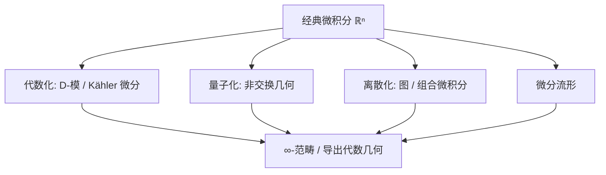

# 微积分基本定理的普适性

> 提炼自 [[微积分的结构推广与大一统-对话]]。它是 [[数学大地图]] §3「方法母题 · 对偶」的样板。

## 概述

所有版本的**同一句话**：

$$\langle d\omega,\ c\rangle=\langle \omega,\ \partial c\rangle\qquad(\text{内部微分} = \text{边界取值})$$

连续形式是**广义 Stokes 定理** $\displaystyle\int_M d\omega=\int_{\partial M}\omega$；离散形式是「上链的余边界 $d$」与「链的边界 $\partial$」的对偶。核心恒等式：$\partial\partial=0 \iff dd=0$。

## 各版本一览

| 版本 | 公式 | 所在结构 |
| --- | --- | --- |
| 经典（一维） | $\int_a^b f'\,dx=f(b)-f(a)$ | 区间 $[a,b]$ |
| Green | $\oint_{\partial D}P\,dx+Q\,dy=\iint_D(Q_x-P_y)\,dA$ | 平面区域 |
| 散度（Gauss） | $\oiint_{\partial V}\mathbf F\cdot d\mathbf S=\iiint_V\nabla\cdot\mathbf F\,dV$ | 空间体 |
| 经典 Stokes | $\oint_{\partial\Sigma}\mathbf F\cdot d\mathbf r=\iint_\Sigma(\nabla\times\mathbf F)\cdot d\mathbf S$ | 曲面 |
| 微分形式 Stokes | $\int_M d\omega=\int_{\partial M}\omega$ | 带边定向流形 |
| 梯度定理 | $\int_\gamma\nabla f\cdot d\mathbf r=f(q)-f(p)$ | 黎曼流形（路径无关） |
| Hodge 分解 | $\omega=d\alpha+d^*\beta+\gamma_{\text{harm}}$ | 紧黎曼流形（调和代表元） |
| Cauchy / 留数 | $\oint_\gamma f\,dz=2\pi i\sum\operatorname{Res}$ | 复流形（$\bar\partial f=0$） |
| Radon–Nikodym | $\nu(E)=\int_E\frac{d\nu}{d\mu}\,d\mu$ | 测度空间 |
| de Rham | $H^k_{\mathrm{dR}}(M)\cong H^k_{\mathrm{sing}}(M;\mathbb R)$ | 拓扑（闭 vs 恰当） |
| Atiyah–Singer | $\operatorname{index}(D)=\int_M\hat A(M)\operatorname{ch}(E)$ | 椭圆算子（分析 = 拓扑） |
| 离散（求和/图） | $\sum_{k=a}^{b-1}\Delta f(k)=f(b)-f(a)$ | 图 / 单纯复形 |

## 不同结构上的微积分

- **拓扑结构**：度量空间上的 Lipschitz 微积分、Sobolev 空间 $W^{1,p}$；Banach 流形上的无穷维微积分。
- **几何结构**：光滑流形（$df$、微分形式、$\star$）→ 黎曼流形（Levi-Civita 联络、测地线、Laplace–Beltrami）→ 辛流形（Hamilton 力学、Liouville、Floer）→ 复/Kähler 流形（$\partial,\bar\partial$、Hodge 分解）→ 图上的离散微积分。
- **代数结构**：交换代数的 **Kähler 微分** $\Omega_{A/k}$、Connes 的**非交换几何**（谱三元组、循环上同调）、超流形（Berezin 积分）、形式幂级数 / $p$-进微积分、**$D$-模**、量子群上的 $q$-导数。

## 大一统的四条线

1. **代数 ↔ 几何镜像对偶**：Gelfand 对偶、Hilbert 零点定理、Grothendieck 概形。
2. **分析 ↔ 拓扑**：de Rham 定理、Hodge 定理、谱几何（Weyl 定律）。
3. **数论 ↔ 几何**：Weil 猜想 × Lefschetz 不动点、概形统一 $\mathbb Z$ 与曲线。
4. **表示论的中心地位**：抽象结构 → 线性算子 → 谱 → 对称性（Langlands、Wigner）。

## 与其他概念的关系

- [[微积分基本定理]] · [[格林定理]] · [[斯托克斯定理与散度定理]] · [[向量分析三大定理]]
- [[线积分]] · [[路径独立与势函数]] · [[切空间与导射]] · [[模2度]] · [[向量场与欧拉数]]

## 深入问题

- 为什么 $\partial\partial=0$（边界的边界为空）是一切的代数根源？
- 「内部微分 = 边界取值」的对偶形式如何在**任意**范畴/函子语言中表述？
- 指标定理之后，「推广」还剩下哪些前沿（导出代数几何、镜像对称、动机理论）？

## 参考源

- [[微积分的结构推广与大一统-对话]]
