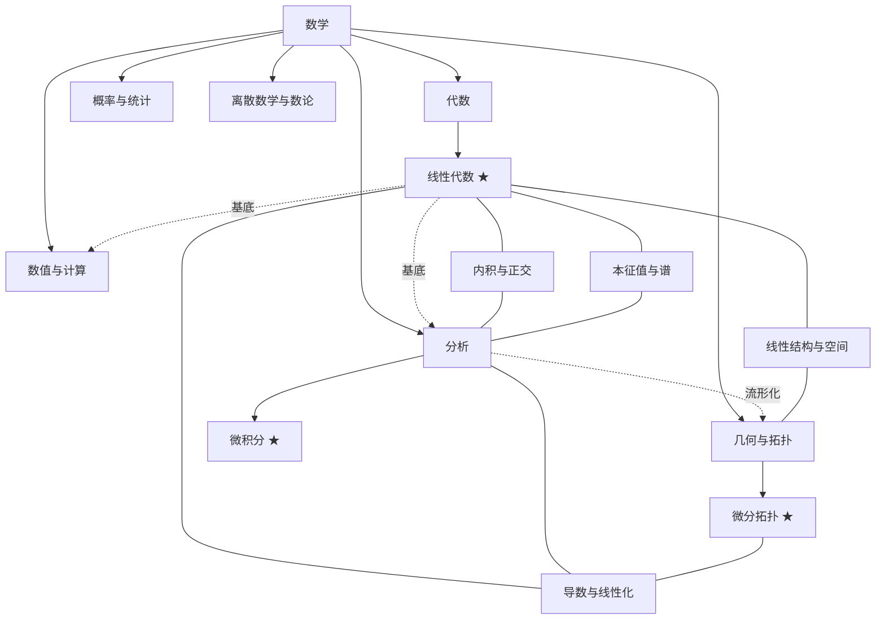

# 数学大地图

> 本库的**顶层入口**：把数学各分支、已收录的书、跨分支主线与学习方法论挂在一张图上。
> 可视版：[[数学大地图.canvas|数学大地图（Canvas）]]。浏览规则：`★ = 已收录`，`◻ = 待补`。

## 0. 怎么用这张图

- 三层结构：`raw`（原文）→ `wiki`（概念）→ `output`（产出）。入口见 [[总索引]]。
- **顺着分支找书，顺着主线跨分支**：分支给坐标，交叉主线（§3）给联系。
- 新书进来 → 在对应分支挂上该书的导读页，并检查是否需要新增交叉主线。

## 1. 总览

## 2. 分支详图

### 代数

- **线性代数 ★** — [[线性代数应该这样学]]（[[线性代数应该这样学-导读|导读]]）
  [[复数]] · [[域]] · [[向量空间]] · [[组与Fⁿ]] · [[子空间与直和]] · [[张成与线性无关]] · [[基与维数]] · [[线性映射]] · [[零空间与值域]] · [[线性映射基本定理]] · [[矩阵]] · [[可逆性与同构]] · [[积与商空间]] · [[对偶空间]] · [[多项式]] · [[本征值与本征向量]] · [[不变子空间]] · [[上三角化与对角化]] · [[内积与范数]] · [[规范正交基与格拉姆-施密特]] · [[正交补与极小化问题]] · [[伴随与自伴算子]] · [[谱定理]] · [[正算子、等距同构与极分解]] · [[奇异值分解]] · [[广义本征向量与幂零算子]] · [[特征多项式与极小多项式]] · [[若尔当形]] · [[复化]] · [[迹与行列式]]
- ◻ 抽象代数（群 / 环 / 域 / 模）、表示论
- ◻ 同调代数

### 分析

- **微积分 ★** — [[托马斯微积分]]（[[托马斯微积分-导读|导读]]）
  [[函数]] · [[极限]] · [[连续性]] · [[导数]] · [[求导法则]] · [[隐式微分与相关变化率]] · [[线性化与微分]] · [[中值定理]] · [[洛必达法则]] · [[牛顿法]] · [[极值与最优化]] · [[双曲函数]] · [[反导数与不定积分]] · [[定积分]] · [[微积分基本定理]] · [[代换法则]] · [[分部积分与三角代换]] · [[部分分式与积分表]] · [[数值积分]] · [[反常积分]] · [[旋转体体积]] · [[弧长与旋转曲面面积]] · [[功与流体压力]] · [[矩与质心]] · [[指数变化与可分离方程]] · [[数列与无穷级数]] · [[级数审敛法]] · [[幂级数]] · [[泰勒级数与麦克劳林级数]]
- ◻ 实分析 / 测度论 ◻ 复分析 ◻ 泛函分析 ◻ 微分方程

### 几何与拓扑

- **微分拓扑 ★** — [[从微分观点看拓扑]]（[[从微分观点看拓扑-导读|导读]]）
  [[光滑流形与光滑映射]] · [[切空间与导射]] · [[正则值与正则点]] · [[Sard定理]] · [[模2度]] · [[定向流形与度]] · [[向量场与欧拉数]] · [[标架式协边]] · [[Pontryagin构造]] · [[一维流形分类]] · [[代数基本定理-拓扑证明]]
- ◻ 点集拓扑 ◻ 代数拓扑（同伦 / 同调） ◻ 微分几何 ◻ 黎曼几何
- 微积分里的 [[向量与空间几何]] · [[向量值函数与曲率]] 是这一分支的“预备篇”。

### 概率与统计

- ◻ 概率论 ◻ 数理统计 ◻ 随机过程 ◻ 信息论

### 离散数学与数论

- ◻ 组合数学 ◻ 图论 ◻ 数论 ◻ 逻辑与可计算性

### 数值与计算

- ◻ 数值线性代数（LU / QR / SVD 的稳定性、条件数、迭代法）
- ◻ 数值分析 ◻ 最优化 ◻ 科学计算
- 相关落地：[[数值积分]] · [[牛顿法]] · [[奇异值分解]]

## 3. 交叉主线（桥）

连接不同分支的同源思想，是本库区别于“孤立笔记堆”的关键。

- [[导数与线性化：分析的共同语言]] — 导数 / 线性映射 / 切空间是同一件事
- [[线性结构：从向量空间到切空间]] — 向量空间 / 基 / 线性映射的三书对照
- [[内积与正交：从范数到梯度]] — 内积、正交、最小二乘与梯度
- [[本征值与谱：从矩阵到数据]] — 本征值 / 谱定理 / Hessian / SVD
- [[向量分析三大定理]] — 格林 / 斯托克斯 / 散度（微积分内部的统一）
- [[微积分符号表]] — 符号与中英术语对照

## 4. 学习方法论

本库不仅是知识，也固化了一套学习方法（源自与 AI 的对话整理，见 [[托马斯微积分-伴读]] 等素材）：

1. **史学 → 对抗 → 对话**：先看发展脉络、划分阶段，在**新旧阶段的衔接处**大量收集反例（失效案例），反复练习并外化（与人 / AI 对话）。
2. **理论以线性代数为基底**：线代提供向量空间、线性映射、内积、谱的语言，是分析、几何、数值、数据的共同底座。
3. **实践因地制宜、对抗式训练**：同一问题用至少两种方法对刀，主动制造“可控的失败”，把“工具使用”换成“判断力”。
4. **贝叶斯更新**：不固化认知，永远保留被新视角改写的空间；分不清时先读书、放下、沉淀，再回来。
5. 详见 [[微积分学习路线]]、各书导读与 output 复习卡。

## 5. 如何扩展这张图

- 新书 → 在 §2 对应分支加一行，用双链指向该书实体页与「书名-导读」页，并列出概念（可链 [[知识索引]]）。
- 出现跨分支联系 → 在 §3 新增一条主线（主题页），并在 [[主题索引]] 登记。
- 维护规范见 [[AGENTS]] 与 `.pi/skills/build-wiki/`。

## 相关

- [[总索引]] · [[知识索引]] · [[素材索引]] · [[产出索引]] · [[主题索引]]
