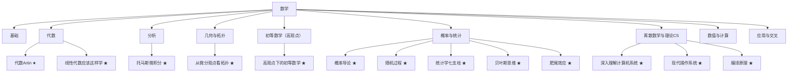

# 数学大地图

> 本库的**顶层入口**。分支只是看数学的**一个**视角；真正的价值在**联系**——同一母题反复出现在代数、分析、几何、概率、数值里。
> 可视版：[[数学大地图.canvas|数学大地图（Canvas）]]。
> 图例：`★ 已收录` · `◆ 下一个计划` · `◻ 待补`。

## 0. 五种视角（怎么读这张图）

| 视角 | 回答的问题 | 在哪一节 |
| --- | --- | --- |
| 一、分支 | 有哪些领域？ | §1 |
| 二、历史 | 它是怎么长出来的？ | §2 |
| 三、方法母题 | 什么东西**处处复用**？ | §3 |
| 四、抽象层次 | 同一件事在不同高度长什么样？ | §4 |
| 五、应用 | 谁在用它、用来做什么？ | §5 |

读法建议：**先用分支定位，再用母题跨域**；看到两条不同分支里出现同一个词（对偶、谱、不变量、极限），就顺着 §3 的链接追过去。

## 1. 视角一 · 分支（经典分类）

<!-- MAP:AUTO:START -->

### 基础 ◻
- ◻ 集合论 · 数理逻辑
- ◻ 公理化 · 范畴论
- ◻ 证明 / 类型论

### 代数
- **代数Artin ★** — [[代数Artin]]（[[代数Artin-导读|导读]]）
  [[群]] · [[群同态与同构]] · [[陪集与拉格朗日定理]] · [[正规子群与商群]] · [[置换群]] · [[凯莱定理]] · [[群作用]] · [[类方程与共轭类]] · [[西罗定理]] · [[自由群与生成元关系]] · [[环与理想]] · [[商环与环同态]] · [[多项式环]] · [[欧几里得整环与主理想整环]] · [[唯一分解整环]] · [[域与域扩张]] · [[伽罗瓦理论]] · [[对称函数]] · [[双线性型]] · [[线性群]] · [[李代数]] · [[群表示与特征标]] · [[正交群与旋转]] · [[平面等距与晶体群]] · [[模]] · [[代数整数与理想类群]] · [[有限域]] · [[佐恩引理]]
- **线性代数应该这样学 ★** — [[线性代数应该这样学]]（[[线性代数应该这样学-导读|导读]]）
  [[复数]] · [[域]] · [[向量空间]] · [[组与Fⁿ]] · [[子空间与直和]] · [[张成与线性无关]] · [[基与维数]] · [[线性映射]] · [[零空间与值域]] · [[线性映射基本定理]] · [[矩阵]] · [[可逆性与同构]] · [[积与商空间]] · [[对偶空间]] · [[多项式]] · [[本征值与本征向量]] · [[不变子空间]] · [[上三角化与对角化]] · [[内积与范数]] · [[规范正交基与格拉姆-施密特]] · [[正交补与极小化问题]] · [[伴随与自伴算子]] · [[谱定理]] · [[正算子、等距同构与极分解]] · [[奇异值分解]] · [[广义本征向量与幂零算子]] · [[特征多项式与极小多项式]] · [[若尔当形]] · [[复化]] · [[迹与行列式]]
- ◻ 抽象代数 · 表示论
- ◻ 交换代数 · 同调代数
- ◻ 数论

### 分析
- **托马斯微积分 ★** — [[托马斯微积分]]（[[托马斯微积分-导读|导读]]）
  [[函数]] · [[极限]] · [[连续性]] · [[导数]] · [[求导法则]] · [[隐式微分与相关变化率]] · [[线性化与微分]] · [[中值定理]] · [[洛必达法则]] · [[牛顿法]] · [[极值与最优化]] · [[双曲函数]] · [[反导数与不定积分]] · [[定积分]] · [[微积分基本定理]] · [[代换法则]] · [[分部积分与三角代换]] · [[部分分式与积分表]] · [[数值积分]] · [[反常积分]] · [[定积分的应用]] · [[旋转体体积]] · [[弧长与旋转曲面面积]] · [[功与流体压力]] · [[矩与质心]] · [[指数变化与可分离方程]] · [[数列与无穷级数]] · [[级数审敛法]] · [[幂级数与泰勒级数]] · [[幂级数]] · [[泰勒级数与麦克劳林级数]] · [[极坐标与圆锥曲线]] · [[向量与空间几何]] · [[向量值函数与曲率]] · [[偏导数]] · [[方向导数与梯度]] · [[多元极值与拉格朗日乘数]] · [[二重积分]] · [[三重积分]] · [[线积分]] · [[路径独立与势函数]] · [[格林定理]] · [[曲面积分与通量]] · [[斯托克斯定理与散度定理]]
- ◻ 实分析 · 复分析 · 泛函
- ◻ 微分方程 · 调和分析

### 几何与拓扑
- **从微分观点看拓扑 ★** — [[从微分观点看拓扑]]（[[从微分观点看拓扑-导读|导读]]）
  [[光滑流形与光滑映射]] · [[切空间与导射]] · [[正则值与正则点]] · [[Sard定理]] · [[模2度]] · [[定向流形与度]] · [[向量场与欧拉数]] · [[标架式协边]] · [[Pontryagin构造]] · [[一维流形分类]] · [[代数基本定理-拓扑证明]]
- ◻ 点集拓扑 · 代数拓扑
- ◻ 微分几何 · 黎曼几何

### 初等数学（高观点）
- **高观点下的初等数学 ★** — [[高观点下的初等数学]]（[[高观点下的初等数学-导读|导读]]）
  [[承袭性原则]] · [[数系扩张]] · [[实数完备性]] · [[超越数]] · [[四元数与超复数]] · [[对数函数与指数函数]] · [[角函数]] · [[带符号的几何量]] · [[格拉斯曼行列式原理]] · [[滑动矢量与自由矢量]] · [[不变量与相对不变量]] · [[导出的流形]] · [[仿射变换]] · [[投影变换与齐次坐标]] · [[反演变换]] · [[对偶变换与对偶原理]] · [[变换群与爱尔朗根纲领]] · [[几何学基础与非欧几何]] · [[精确数学与近似数学]] · [[函数带]] · [[一致连续性与可积性]] · [[魏尔斯特拉斯函数]] · [[合理函数]] · [[拉格朗日插值与切比雪夫逼近]] · [[傅里叶级数与三角展开]] · [[球函数]] · [[康托集与完备集]] · [[皮亚诺曲线与若当曲线]] · [[正则曲线与解析曲线]]
- ◻ 初等算术 · 数论
- ◻ 经典几何 · 尺规作图

### 概率与统计
- **概率导论 ★** — [[概率导论]]（[[概率导论-导读|导读]]）
  [[概率空间]] · [[条件概率与贝叶斯公式]] · [[大数定律与中心极限定理]]
- **随机过程 ★** — [[随机过程]]（[[随机过程-导读|导读]]）
  [[马尔可夫链]] · [[泊松过程]] · [[鞅]] · [[布朗运动]]
- **统计学七支柱 ★** — [[统计学七支柱]]（[[统计学七支柱-导读|导读]]）
  [[描述统计与统计推断]] · [[似然]] · [[回归与回归均值]]
- **贝叶斯思维 ★** — [[贝叶斯思维]]（[[贝叶斯思维-导读|导读]]）
  [[贝叶斯推断]] · [[先验与后验]] · [[蒙特卡洛方法]]
- **肥尾效应 ★** — [[肥尾效应]]（[[肥尾效应-导读|导读]]）
  [[重尾分布]] · [[幂律分布]] · [[遍历性]]
- ◻ 信息论
- ◻ 因果推断

### 离散数学与理论CS
- **深入理解计算机系统 ★** — [[深入理解计算机系统]]（[[深入理解计算机系统-导读|导读]]）
  [[浮点数与IEEE 754]] · [[存储层次与局部性]] · [[虚拟内存]]
- **现代操作系统 ★** — [[现代操作系统]]（[[现代操作系统-导读|导读]]）
  [[进程与线程]] · [[死锁与同步]] · [[虚拟内存]]
- **编译原理 ★** — [[编译原理]]（[[编译原理-导读|导读]]）
  [[形式语言与自动机]] · [[词法与语法分析]] · [[编译流程与中间表示]]
- ◻ 组合 · 图论
- ◻ 算法 · 可计算性

### 数值与计算 ◻
- ◻ 数值线性代数
- ◻ 最优化 · 科学计算

### 应用与交叉 ◻
- ◻ 数学物理 · 数据科学
- ◻ 金融数学 · 运筹学
<!-- MAP:AUTO:END -->
## 2. 视角二 · 历史脉络

数学不是按分支长出来的，而是按**问题**长出来的。抓几个「衔接处」，那里正是反例密集区（呼应 §7 的对抗式学习）：

| 阶段 | 旧范式的失效 | 催生的新语言 |
| --- | --- | --- |
| 算术 → 代数 | “数”不够用、方程解不出 | 符号、未知量、[[域]]与[[复数]] |
| 初等几何 → 解析几何 | 纯综合几何难以计算 | 坐标、[[向量与空间几何]] |
| 微积分初创 → 严格化 | 无穷小“说不清” | [[极限]]、$\varepsilon$-$\delta$、实分析 |
| 具体 → 结构 | 各领域“各行其是” | 公理化：[[向量空间]]、群、拓扑空间 |
| 初等 → 高观点 | 初等对象孤立、缺动机 | 变换群、子行列式、函数带（Klein） |
| 结构 → 同调/范畴 | 结构之间关系难统一 | 函子、同调、层 |

## 3. 视角三 · 方法母题（数学处处是联系）

**这是全图的核心。** 同一母题横跨几乎所有分支——顺着行读，就能从一门课跳到另一门课。

| 母题 | 代数 | 分析 | 几何 / 拓扑 | 概率 / 统计 | 数值 / 离散 / 数据 |
| --- | --- | --- | --- | --- | --- |
| **线性化 / 逼近** | 线性映射 · 矩阵 | [[导数]] · [[泰勒级数与麦克劳林级数]] | [[切空间与导射]] · 局部坐标 | 线性回归 · CLT 近似 | [[牛顿法]] · 迭代法 · [[拉格朗日插值与切比雪夫逼近]] · [[浮点数与IEEE 754|浮点]] |
| **对偶** | [[对偶空间]] · 转置 | Fourier · 分布 · $L^p$–$L^q$ | Poincaré 对偶 · [[对偶变换与对偶原理]] | 特征函数 · 对偶问题 | 拉格朗日对偶 · 伴随 |
| **不变量 / 分类** | 秩 · [[迹与行列式]] · Galois | 守恒量 · 指标 | [[模2度]] · [[向量场与欧拉数]] · 同调 · [[格拉斯曼行列式原理]] · [[变换群与爱尔朗根纲领]] | 充分统计量 | 条件数 · 谱 |
| **对称 / 群作用** | 群 · 表示论 | 对称函数 | 对称空间 · Lie 群 | 可交换性 | 分块 · 置换群 |
| **极限 / 收敛** | 矩阵幂 · 谱半径 | [[数列与无穷级数]] · 一致收敛 · [[实数完备性]] · [[一致连续性与可积性]] | 紧性 · 同伦极限 | [[大数定律与中心极限定理|大数律 · CLT]] | 迭代收敛 · 误差分析 |
| **分解 / 谱** | [[谱定理]] · [[奇异值分解]] · [[若尔当形]] | 特征函数 · Fourier · [[球函数]] | Laplace 特征值 | [[马尔可夫链|马尔可夫链谱]] · PCA | QR / SVD · 特征值算法 |
| **计数 / 测度** | 组合恒等式 | [[定积分]] · 测度 | 体积 · 度数 | 概率 · 期望 | 求和 · 复杂度 |
| **优化 / 变分** | 二次型 · 正定 | Euler–Lagrange · 最速下降 | 测地线 · 极小曲面 | MLE · EM | 凸优化 · 梯度下降 |

> 用法：遇到不熟的概念，先看它落在哪一行母题，再横向对照其他分支——「联系」本身就是学习杠杆。

## 4. 视角四 · 抽象层次

同一件事，在不同高度长得很不一样：

| 层次 | 关注 | 例子 |
| --- | --- | --- |
| L0 计算 | 怎么算 | [[定积分]]、[[若尔当形]]、SVD 算法 |
| L1 结构 | 对象是什么 | [[向量空间]]、群、拓扑空间 |
| L2 映射 | 对象之间怎么连 | [[线性映射]]、连续映射、[[切空间与导射]] |
| L3 联系本身 | 把“联系”当对象 | 函子、同调、层、范畴 |

> 你的「低维视角合成完整」（§7）对应这里：同一对象在 L0–L3 的投影各自片面，合起来才完整。

## 5. 视角五 · 应用与交叉

| 领域 | 用到的核心 | 本库相关 |
| --- | --- | --- |
| 物理 / 工程 | 微积分 · 微分方程 · 线性代数 | [[向量场与欧拉数]] · [[线积分]] · [[斯托克斯定理与散度定理]] |
| 数据 / ML | 线性代数 · 概率 · 最优化 | [[奇异值分解]] · [[本征值与谱：从矩阵到数据]] |
| 计算机图形 | 向量 · 线性变换 · 微积分 | [[向量与空间几何]] · [[向量值函数与曲率]] |
| 金融 / 运筹 | 概率 · 最优化 · 随机过程 | ◻ 概率论 · ◻ 最优化 |

## 6. 交叉主线（桥）

连接不同分支的同源思想，是本库区别于“孤立笔记堆”的关键。

- [[导数与线性化：分析的共同语言]] — 导数 / 线性映射 / 切空间是同一件事
- [[线性结构：从向量空间到切空间]] — 向量空间 / 基 / 线性映射的三书对照
- [[内积与正交：从范数到梯度]] — 内积、正交、最小二乘与梯度
- [[本征值与谱：从矩阵到数据]] — 本征值 / 谱定理 / Hessian / SVD
- [[向量分析三大定理]] — 格林 / 斯托克斯 / 散度（微积分内部的统一）
- [[微积分基本定理的普适性]] — 从 Newton–Leibniz 到 Stokes 到指标定理（各结构上的版本）
- [[拓扑与分析概念辨析]] — 紧致 / 正则 / 非退化等易混概念
- [[微积分符号表]] — 符号与中英术语对照
- [[不变量与对偶：从格拉斯曼到线性代数]] — 子式 / 对偶空间 / 不变量理论的几何原型
- [[数系扩张与承袭性：从算术到四元数]] — 数系 / 域 / 可除环的扩张阶梯
- [[精确与近似：数学的两副面孔]] — 函数带 / 合理函数 / 严格分析
- [[几何的变换群视角：从欧几里得到爱尔朗根]] — 变换群 / 不变量 / 流形
- [[概率与谱：从协方差到随机矩阵]] — 协方差 / 谱隙 / 随机矩阵
- [[表示与近似：从浮点数到函数带]] — 浮点数 / 函数带 / 数值分析
- [[概率、统计与重尾：三条不确定性路径]] — 概率 / 统计 / 重尾
- [[形式语言与计算：编译器的数学骨架]] — 正则 / CFG / 自动机 / 编译

## 7. 学习方法论（元层）

本库不只是知识，也固化了一套学习方法，详见 [[数学学习方法论]]（原始对话：[[学习方法论-对话]]）：

1. **史学 → 对抗 → 对话**：在**新旧阶段的衔接处**收集反例（§2 的表就是这种衔接处）。
2. **理论以线性代数为基底**：它是分析/几何/数值/数据的共同底座。
3. **因地制宜的对抗式训练**：同题两种方法对刀，主动制造可控失败，要“决策报告”而非“结果”。
4. **贝叶斯更新**：分不清时先读书、放下、沉淀；不固化认知，永远保留被新视角改写的空间。
5. **合发生在联系里**：理解在联系中加深，没有终态——所以这张图永远会有下一条连线。

## 8. 如何扩展这张图

- 新书 → 在 §1 对应分支加一行，用双链指向该书实体页与「书名-导读」，并列出概念。
- 新联系 → 在 §3 母题表补一格，或（跨书更系统性时）在 §6 新增一条主题页，并登记 [[主题索引]]。
- 新视角 → 若发现现有五个视角不够，可在 §0 增加第六个（本图欢迎被改写）。
- 可视版 `数学大地图.canvas` 同步加减节点（id 唯一、边不悬空）。
- 维护规范见 [[AGENTS]] 与 `.pi/skills/build-wiki/`。

## 相关

- [[总索引]] · [[知识索引]] · [[素材索引]] · [[产出索引]] · [[主题索引]]
